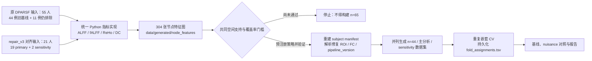

# OA fMRI 项目接管交接（2026-07-27）

> [!NOTE]
> 本文件是阶段 D 开始前的接管快照，不再代表仓库当前状态。后续状态以
> [`DECISION_PHASE1_N62_N64_2026-07-27.md`](DECISION_PHASE1_N62_N64_2026-07-27.md)、
> [`FINAL_VALIDATION_REPORT.md`](../reports/phase1-n62-n64/FINAL_VALIDATION_REPORT.md)
> 和 [`WINDOWS_TMP_RESCUE_2026-07-27.md`](WINDOWS_TMP_RESCUE_2026-07-27.md)
> 为准。

本文件结论基于当时的本地镜像、学校服务器、运行时产物和测试核验；旧版
[`HANDOFF.md`](HANDOFF.md) 截止于更早的阶段 D 开始前，仍保留作为历史记录。

> [!IMPORTANT]
> 阶段 D 尚未完成。四类节点特征已经为 76 人生成，但新的覆盖率审计发现：修复被试的空间缺口可使 ROI 均值偏移最高达到 **0.353 z**。在确定统一空间支持策略前，禁止直接忽略 NaN、禁止补 0，也不要生成或发布所谓的 “n=65 主结果”。

## 一页结论

| 项目 | 当前状态 | 证据状态 |
|---|---|---|
| 当前提交 | `b6cb5f6`，本地镜像与服务器代码一致 | `OBSERVED` |
| 运行中任务 | 无 `build_node_features`、`pytest` 或 Phase 1 进程 | `OBSERVED` |
| 自动测试 | 当前提交在服务器上 **37/37 通过**，94.73 秒 | `OBSERVED` |
| 节点特征图 | 76 人 × 4 指标 = **304 张 NIfTI**；无临时文件 | `OBSERVED` |
| 特征图完整性 | 0 张全 NaN；220 张全有限；84 张含局部缺口，恰为 21 名修复被试 × 4 | `OBSERVED` |
| 特征溯源 | 76 人 × 3 个输入角色 = 228 行，加表头共 229 行 | `OBSERVED` |
| n=44 基线 | NPZ 仍为 `(44, 90, 4)`；基线报告仍是 2026-07-14 产物 | `OBSERVED` |
| n=65 数据集 | **尚未生成** | `OBSERVED` |
| 折分配文件 | `fold_assignments.tsv` 不存在 | `OBSERVED` |
| GitHub | `onephantomcat/Fmri` 已确认是 **PRIVATE**；本地 `origin` 仍只指向学校服务器 | `OBSERVED` |
| 项目就绪度 | n=65 流水线最多处于 `TECHNICAL PROTOTYPE`；不支持临床或外部验证声称 | `OBSERVED` |

证据状态说明：

- `OBSERVED`：本次接管中直接读取代码、文件、Git 或运行时得到。
- `PROPOSAL`：尚未执行的计划或推荐。
- `EXTERNALLY VERIFIED`：由独立外部来源核验；本文件没有使用此状态支撑模型结果。

---

## 当前数据流与硬门槛



当前停在 `G`：特征计算本身已可运行，但怎样让所有被试在**相同空间支持**上得到可比 ROI 特征，尚未决定。

---

## 本轮接管实际完成的工作

### 1. 重新核验本地与服务器状态

- 本地仓库：`[本机路径已省略]`
- 服务器仓库：`[本机路径已省略]`
- 两端代码均停在 `b6cb5f6`。
- 本地镜像在写入本交接文件前工作树干净。
- 服务器当前有两个不可删除的未跟踪科学产物：
  - `data/generated/node_features_provenance.tsv`
  - `data/generated/aal90_coverage.tsv`
- `origin` 是学校服务器的 SSH 仓库，不是 GitHub。
- `phase1-n44` 标签存在，指向提交 `a7a77a2`。

### 2. 复核最终特征图状态

第二轮修复被试重算已经完成。最终检查结果：

| 检查 | 结果 |
|---|---:|
| NIfTI 文件 | 304 |
| `.tmp.nii` | 0 |
| 全 NaN 图 | 0 |
| 掩膜内全有限图 | 220 |
| 含局部非有限值图 | 84 |
| 受局部缺口影响的被试 | 21 |

四种指标对每名修复被试给出了相同的缺失体素数，说明 `b6cb5f6` 修复了先前 fALFF/DC 静默填 0、而 ALFF/ReHo 保留 NaN 的不一致。

### 3. 补跑覆盖缺口审计

执行：

```bash
[本机路径已省略] \
  scripts/assess_coverage_gaps.py \
  --config config/paths.linux.toml
```

新产物：

```text
data/generated/aal90_coverage.tsv
sha256 79711b1127ac76f871e3d9ea941dbcf3f992826f8949294c5a0b124f0d6ef3c1
```

结果摘要：

| 指标 | 结果 |
|---|---:|
| 记录数 | 21 被试 × 90 ROI = 1,890 |
| 最低单 ROI 覆盖率 | 0.886503 |
| 覆盖率低于 99% 的被试-ROI 行 | 62 |
| 覆盖率低于 95% 的被试-ROI 行 | 9 |
| 覆盖率低于 90% 的被试-ROI 行 | 1 |
| 21 人缺口并集 | 476 个 AAL90 体素 |
| 三名满覆盖供体上的最大 ROI 均值偏移 | **0.3531 z** |

最差覆盖个案是 `[个体编号已省略]`：256 个 AAL90 体素无测量，7 个 ROI 低于 99%，2 个低于 95%，1 个低于 90%。该被试同时带有 `short_run_flag=1`。

> [!IMPORTANT]
> `0.3531 z` 是诊断性 punch-out 测试，不是置信区间或总体效应估计；但它已经足以否定“缺口很小，所以忽略 NaN 后直接求均值”的默认做法。

### 4. 复跑当前提交的完整测试

为避免测试缓存和字节码写入，使用：

```bash
export OA_REBUILD_CONFIG="$PWD/config/paths.linux.toml"
export PYTHONDONTWRITEBYTECODE=1
[本机路径已省略] -q -p no:cacheprovider
```

结果：

```text
37 passed in 94.73s
```

这证明当前代码仍满足既有 44 人/DPABI 参照契约；它**不证明**新的 n=65 分析契约已经成立。

---

## 已完成与未完成的准确边界

### 已完成

1. **版本控制基础**
   - 项目已不再是零提交仓库。
   - 本地镜像与服务器各有一份 Git 历史。
   - n=44 状态已用 `phase1-n44` 标签固定。

2. **Linux 运行环境**
   - Python 3.12 与 `uv` 环境位于 `[本机路径已省略]`。
   - 数据、缓存和派生产物位于 4 TB NTFS 数据盘。
   - 服务器无可用外网，依赖需由 Mac 下载后离线传入。

3. **MATLAB/DPABI 指标替代**
   - `src/oa_rebuild/features.py` 实现 ALFF、fALFF、ReHo、DC 和 z 化。
   - 既有满覆盖数据上与 DPABI 参照吻合。
   - 修复被试的无测量体素现在在四类图中一致标记为非有限值。

4. **阶段 D 的特征生成子步骤**
   - `scripts/build_node_features.py` 已跑完。
   - 76 人的输入溯源完整：
     - 55 人 `dparsf_original` × 3 = 165 行；
     - 21 人 `repair_v3` × 3 = 63 行。

### 未完成

1. **覆盖率策略未冻结**
   - 当前 `_extract_roi_means()` 禁止 ROI 内出现任何非有限值。
   - 不能把它简单改成 `nanmean()`；新审计已证明这会产生不可忽略的支持域偏差。

2. **修复被试的数据源解析尚未接入**
   - `quality.py` 和 `aal90.py` 仍读取 `work2/Results` 的旧 ROI/FC 和旧特征目录。
   - 对 21 名修复被试，正确 ROI/FC 位于：

     ```text
     outputs/dpabi_aal116_realign/runs/repair_v3_aal116104_20260721/
       attempts/[个体编号已省略]/attempt-NN/rerun_aligned/
     ```

   - 可用文件包括 `ROISignals_AAL116_[个体编号已省略].mat` 和
     `ROICorrelation_FisherZ_FiniteDiag0_AAL116_[个体编号已省略].mat`。

3. **n=65 数据集尚未构建**
   - `oa_aal90_multifeature.npz` 仍是 44 人，`node_features.shape == (44, 90, 4)`。
   - `subject_manifest.tsv` 虽有 76 行，但仍只有 44 行 `qc_aal90_pass=1`。
   - `baseline_nested_cv.json` 仍记录 44 人（13 control / 31 patient）。

4. **嵌套 CV 折分配尚未持久化**
   - `fold_assignments.tsv` 不存在。
   - 因此任何后续 GCN/GAT/BrainHGT 结果都还不能与经典基线进行严格同折比较。

5. **n=44 与新分析尚未并列命名**
   - 当前 Linux 配置仍把输出指向原文件名。
   - 直接执行 `phase1` 会覆盖工作树中的 n=44 产物；虽然 Git 可恢复，但不符合并列比较契约。

6. **GitHub 已转私有，但尚未同步当前历史**
   - `onephantomcat/Fmri` 已在本次核验中确认是 `PRIVATE`。
   - GitHub `main` 当前为独立根提交 `dd7fa305`（`Initial commit`），内容只有一个 6 字节的 `README.md`。
   - 本地 `b6cb5f6` 历史与 GitHub `main` 没有共同祖先；不能直接快进推送，也不应使用 `--force` 覆盖。
   - 当前仓库没有 GitHub remote；不要假设 GitHub 已包含服务器上的最新提交。
   - `LICENSE` 和 `CITATION.cff` 仍缺少真实作者/单位信息。

7. **修复状态路径仍不一致**
   - 数据盘内实际存在 21 个 `pipeline_status.json`。
   - 但 `cohort_terminal_states.tsv` 的 `status_path` 仍指向 Windows `[本机路径已省略]` 临时目录。
   - 在宣称“盘外溯源已救回”前，需要逐一比对数据盘文件是否就是对应的最终状态文件，并把清单改成可移植相对路径。

---

## 必须先做出的两个方法学决定

### 决定 A：共同空间支持

| 方案 | 评价 | 当前建议 |
|---|---|---|
| 对每张图直接 `nanmean()` | 支持域随被试变化；已观察到最高 0.353 z 偏差 | **禁止作为主分析** |
| 把 NaN 填 0 | 把“无测量”变成强负信号，且与修复状态共线 | **禁止** |
| 预先定义覆盖率阈值并排除被试/ROI | 简单透明，但会缩小样本并可能再次产生非随机选择 | 可作为候选，须先报告分组分布 |
| 为拟纳入队列构造共同有限体素掩膜，并对所有人统一重算 | 保持每个 ROI 的空间支持一致，但会改变全部人的计算域 | **优先评估的候选方案** |
| 将覆盖率作为协变量 | 无法修复节点特征本身定义不同，只能作敏感性分析 | 不可单独解决问题 |

在选择共同掩膜方案时，不能只在 ROI 聚合阶段删体素。ALFF/fALFF 的 z 化统计域、ReHo 邻域和 DC 全脑相关网络都受掩膜影响；最稳妥的候选实现是用预注册的共同掩膜对全部拟纳入被试重新计算四类指标，再重新验证满覆盖参照与差异。

### 决定 B：主分析队列

`cohort_terminal_states.tsv` 对 21 名修复被试的现有标记为：

- 19 名：`ml_disposition=primary`
- 2 名：`ml_disposition=sensitivity`（`[个体编号已省略]`、`[个体编号已省略]`）
- `[个体编号已省略]`：标记为 primary，但 `short_run_flag=1`

因此现有证据自然支持以下待确认设计：

1. `PROPOSAL` 主分析：44 + 19 = **n=63**；
2. `PROPOSAL` sensitivity：加入 `[个体编号已省略]`、`[个体编号已省略]`，得到 **n=65**；
3. `PROPOSAL` 额外敏感性：排除短序列 `[个体编号已省略]`。

旧对话中曾口头选择“按 n=65 推进”，但这与数据清单的 `primary/sensitivity` 标记不完全一致。正式重建前应由项目负责人确认并写入配置，不能由代码默默决定。

---

## 推荐的续跑顺序

### GitHub 安全同步：单独处理

隐私阻断已经解除，但历史不相干。推荐先把当前历史推到一个新分支，保留 GitHub 的初始提交，再由负责人确认合并方式：

```bash
git remote add github git@github.com:onephantomcat/Fmri.git
git push github main:import/oa-rebuild
```

这会新增远端分支，不改写 GitHub `main`。执行前仍应检查没有凭据、直接标识符或不打算公开给仓库协作者的未发表产物；本次接管**没有执行该推送**。

### Step 0：冻结覆盖与队列契约

1. 扩展 `assess_coverage_gaps.py`：
   - 不只使用 `[个体编号已省略]/02/03` 三名供体；
   - 分别评估 n=63、n=65 和排除 `[个体编号已省略]` 的候选支持域；
   - 输出每个候选方案的共同掩膜大小、ROI 覆盖、标签/Study/扫描长度分布和最大偏移。
2. 把最终选择写入版本化配置和一份短决策记录。
3. 未完成这一步前，不修改 `qc_aal90_pass`，也不运行 `phase1`。

### Step 1：建立单一受试者数据源解析器

建议新增一个集中式解析器，供 `quality.py`、`aal90.py` 和溯源逻辑共用，避免三处各自判断：

- 21 名 verified repair：使用 published attempt 下的修复 ROI/FC；
- 其余人：使用原 `work2/Results`；
- 四类节点特征：全部使用统一 Python 输出目录；
- 每行显式记录：
  - `pipeline_version`
  - `repair_attempt`
  - `motion_tier`
  - `ml_disposition`
  - `short_run_flag`
  - 预注册的 coverage 指标

### Step 2：先补测试，再构建数据集

最低测试要求：

1. 76 个受试者 ID 唯一；
2. 数据源解析精确得到 55 original + 21 repair；
3. 11 名 `not_published` 修复失败者仍被排除；
4. 304 张图存在且没有全 NaN；
5. 同一被试四张图的有限体素掩膜一致；
6. 主分析队列的共同支持域固定且可哈希；
7. n=44 历史产物可从 `phase1-n44` 精确复现；
8. 新数据集包含不可变的 subject IDs、配置哈希、掩膜哈希和源文件哈希。

### Step 3：输出必须并列，不得覆盖

推荐命名：

```text
data/generated/phase1-n44/
data/generated/phase1-n63-primary/
data/generated/phase1-n65-sensitivity/

reports/phase1-n44/
reports/phase1-n63-primary/
reports/phase1-n65-sensitivity/
```

不要继续让三个分析版本共用 `oa_aal90_multifeature.npz` 和
`baseline_nested_cv.json` 这两个无版本文件名。

### Step 4：补齐折分配与 nuisance 对照

修改 `run_nested_baseline()` / `write_baseline_artifacts()`，新增：

```text
subject_id
repeat
outer_fold
split_seed
cohort_version
```

要求：

- 同一受试者全部数据只在一个 outer fold；
- 标准化、特征选择和超参数选择只在训练折内；
- 图模型复用完全相同的 outer folds；
- 扫描时间点 nuisance 基线与影像模型并列报告；
- 主指标仍为 repeat-level OOF ROC AUC 均值与样本标准差；
- 不把 cross-fit ensemble AUC 当作主结果。

---

## 科学与安全边界

> [!NOTE]
> 本项目目前只支持公开数据上的研究性方法开发。ds000208 的 response、VAS 和 WOMAC 字段不是“神经病理性疼痛严重度金标准”，不能据此声称完成疼痛智能分级或临床诊断。

- 分析单位：受试者。
- 当前端点：公开数据中的 patient/control 二分类；不是前瞻性临床诊断。
- 当前验证：内部重复嵌套交叉验证；没有外部或前瞻性验证。
- 既有 n=44 节点特征 AUC `0.816 ± 0.018` 是现有报告中的结果，本次未重新训练验证。
- 复杂图模型若显著超过该结果，应先按泄漏、批次、扫描长度、缺失模式和架构选择乐观性排查。
- 旧 `GAT.py`/LOOCV/事后阈值结果只能作为历史材料，不可作为公平基线。
- 所有报告应标注：`Research use only - clinician review required`。

---

## 服务器与运维约束

- 学校服务器账户无 sudo，仅属于自身用户组。
- `/home` 仍是 99% 使用、约 32 GB 可用；不要安装 CUDA 大环境。
- 4 TB 数据盘当前为 NTFS/FUSE，约 2.6 TB 可用，适合数据和输出，不适合 Python 环境。
- 服务器没有正常外网；不要反复尝试在线 `pip`/`uv`。
- 不执行 `mkfs`、`fsck`、强制卸载、`/etc/fstab` 修改或权限扩大。
- 不使用 GPU0；图模型阶段优先 CPU，直到确有证据需要 GPU。

---

## 接班人第一组命令

先确认状态，不要立即构建：

```bash
cd [本机路径已省略]
git status --short --branch
git log --oneline --decorate -8
```

服务器只读核验：

```bash
ssh user001@[处理服务器地址已省略]
cd [本机路径已省略]
git status --short --branch
find data/generated/node_features -maxdepth 1 -name '*.nii' | wc -l
wc -l data/generated/node_features_provenance.tsv
wc -l data/generated/aal90_coverage.tsv
```

复跑测试：

```bash
export OA_REBUILD_CONFIG="$PWD/config/paths.linux.toml"
export PYTHONDONTWRITEBYTECODE=1
[本机路径已省略] -q -p no:cacheprovider
```

> [!IMPORTANT]
> 下一步不是运行 `phase1`，而是先完成“共同空间支持 + 主分析队列”的决策与测试。

---

## 交接验收清单

- [x] 本地与服务器提交核对
- [x] 后台进程核对
- [x] 304 张图及临时文件核对
- [x] 76 人特征溯源核对
- [x] 当前提交 37 项测试复跑
- [x] 覆盖率审计执行并保存
- [x] n=44 产物仍未覆盖
- [x] GitHub 已转为私有
- [ ] 将当前历史非破坏性同步到 GitHub 新分支
- [ ] 确认 n=63 primary / n=65 sensitivity 设计
- [ ] 确认共同空间支持策略
- [ ] 扩展覆盖审计并固化掩膜
- [ ] 接入修复 ROI/FC 数据源
- [ ] 生成并验证新数据集
- [ ] 持久化 outer fold 分配
- [ ] 重跑 nuisance 与影像基线
- [ ] 独立复核后再进入图模型阶段

最小且合理的下一动作是：**扩展覆盖缺口评估，比较候选共同掩膜与候选队列；在负责人确认主分析契约后，再修改数据构建代码。**
