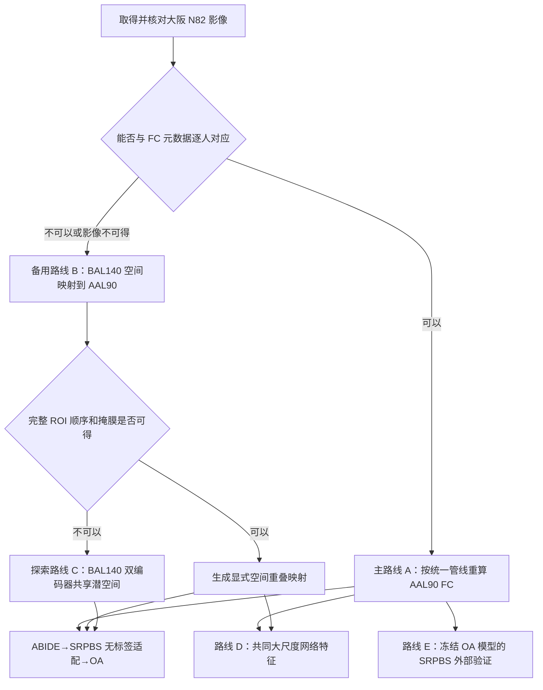

# SRPBS 大阪疼痛数据接入迁移学习的详细实施计划

日期：2026-08-23
状态：实施计划；尚未开始影像重算或新增正式模型运行

## 1. 目标与当前边界

目标是让 SRPBS 大阪 N82 疼痛队列以可解释、可复现且不污染 OA 外层测试集的方式参与
现有 ABIDE→OA AAL90 功能连接迁移学习。

当前已经确认：

- 大阪文件包含 82 人：43 名难治性神经病理性疼痛患者、10 名卒中后无疼痛患者和
  29 名健康对照；
- 每人静息态扫描约 10 分钟，TR=2.5 秒，记录为 240 个正式体积加 4 个 dummy 体积；
- 官方 FC 是 140 ROI、9,730 条下三角边，并按 MATLAB 列优先顺序展开；
- 官方处理对左侧疼痛患者的影像做过左右翻转；
- 当前 ABIDE/OA 编码器输入是 AAL90、4,005 条 Fisher-Z FC 边；
- SRPBS-FC 归档及 FC—元数据行数已经完成审计，但本机尚没有被确认可与这 82 人逐一
  对应的 SRPBS rs-fMRI NIfTI 影像包；
- 固定 ABIDE 编码器相对 OA-fold SSL 的主要 AUC 差异为正，但 1,000 次置换检验
  `p=0.3576`，所以 SRPBS 阶段的目标是检验域适配和外部泛化，而不是预设一定提高 AUC。

本计划不把“尺寸是 90×90”视为兼容证据，也不采用截取前 90 个 ROI、截取前 4,005
条边或补零的方法。

## 2. 路线与优先级



实施优先级：

1. **主路线 A：从影像重算 AAL90 FC**；
2. **备用路线 B：BAL140→AAL90 空间映射**，仅在影像不可用而完整 ROI 证据可用时；
3. **探索路线 C：双编码器/共享潜空间**，用于无法得到可靠逐 ROI 映射的情况；
4. **路线 D：共同网络级特征**，作为低维稳健性分析；
5. **路线 E：纯外部验证**，与是否进行无标签域适配相互独立。

## 3. 所有路线共用的准备工作

### 3.1 数据盘点与受试者对应

输入：

- `SRPBS_FC/.../OsakaU/SUBINFO_OsakaU_N82.tsv`；
- `SRPBS_FC/.../OsakaU/BAL-Osaka_FC_NP_N82.mat`；
- 获批或注册取得的 SRPBS MRI 数据、README、扫描协议和 QC 表；
- `ROITBL_BAL.mat` 及获批后的 FcBm 代码或说明。

操作：

1. 新增 `scripts/inventory_srpbs_mri.py`，列出影像 ID、站点、模态、扫描次数、体积数、
   TR、空间尺寸及可用 fieldmap；
2. 只通过官方 participant ID 或官方对应表连接 MRI 与 N82 元数据，不根据文件顺序、
   年龄或性别猜配；
3. 生成三类名单：`matched`、`fc_only`、`mri_only`；
4. 给模型输入使用 `SRPBS:OsakaU:<participant_id>` 命名空间；
5. 保留 condition、VAS、SF-MPQ2、疼痛侧别、疼痛部位、站点和官方 scrubbing 剩余比例，
   但无标签适配阶段不把 condition/VAS/SF-MPQ2 输入模型。

输出：

```text
data/generated/srpbs-osaka-inventory/
├── subject_linkage.tsv
├── imaging_inventory.tsv
├── unmatched_subjects.tsv
└── inventory_summary.json
```

直接验证：逐项打开若干匹配受试者的 NIfTI 与元数据；统计 43/10/29 是否由文件内容
自然得到；任何未匹配者保持未匹配，不补造 ID。

### 3.2 明确“原始影像”和“预处理影像”

对每个影像包记录其实际处理阶段：

- 若是原始/近原始 NIfTI：从 slice timing、realignment 等步骤开始；
- 若已经配准或标准化：读取处理日志、空间模板、插值方式和混杂回归说明，避免重复
  slice timing、重复滤波或重复平滑；
- 若只有标准化 4D 影像但没有逐时间点运动参数或 censor 向量：可以建立自有统一
  AAL90 重算管线，但不能声称精确复现官方 scrubbing；
- 元数据中的“剩余帧百分比”不能替代逐帧 censor 向量。

## 4. 主路线 A：从影像重新计算 AAL90 FC

### A1. 固化本项目实际使用的预处理参数

首先从 OA 的 DPABI 配置、运行日志和 ABIDE `dparsf/filt_global` 说明中抄录**已经实际
使用**的参数，而不是凭记忆新设参数：

- dummy volumes；
- slice timing 顺序；
- realignment 和运动量定义；
- EPI–T1 配准、T1 分割及 MNI 标准化；
- 目标体素尺寸和 `AAL_61x73x61_YCG.nii` 的 61×73×61 网格；
- 空间平滑核；
- 头动参数、头动导数、白质、CSF 和全局信号回归；
- scrubbing 指标、阈值、前后扩展帧和最少保留时间点；
- 带通范围及回归、scrubbing、滤波的执行顺序。

主分支复用当前项目的 `GlobalC`（全局信号回归）定义。若官方 SRPBS/FcBm 参数与
OA/ABIDE 不同，分别保存“跨数据集统一管线”和“官方 SRPBS 复现管线”，不把两者的
输出混在同一数据版本中。

### A2. 左右方向处理

建立两个明确分开的派生分支：

1. `native_orientation`：不依据疼痛侧翻转。它是接入 ABIDE/OA AAL90 编码器的主输入，
   因为源编码器学习的是固定左、右半球语义；
2. `official_pain_side_flip`：按 SRPBS 说明翻转左侧疼痛患者，只用于重建 BAL140 并与
   官方 FC 比较。

只有当 OA 目标数据也存在可靠疼痛侧别，且对 OA 和 SRPBS 使用完全相同的疼痛侧
归一化时，才增加 `pain_side_canonicalized` AAL90 敏感性分析。不得只翻转 SRPBS 后
直接输入保持原始方向的 ABIDE/OA 编码器。

### A3. 运行影像预处理

建议新增：

```text
scripts/prepare_srpbs_preprocessing_inputs.py
scripts/run_srpbs_dpabi_preprocessing.ps1
scripts/audit_srpbs_preprocessing.py
```

处理结果放在仓库外的受控数据目录，仓库中只保存非敏感审计表和相对路径。每名受试者
至少保存：最终 4D 文件、实际保留时间点、运动统计、使用的混杂项、空间网格、AAL90
覆盖情况和排除原因。

直接检查：随机抽取不同组别和站点受试者，查看配准叠图、脑覆盖、运动曲线和 censor
位置；统计每个 AAL90 ROI 的有效体素数与时序方差。沿用当前 AAL90 数据契约：不得用
NaN 均值或补零掩盖空 ROI、零方差时序或非有限值。

### A4. 提取 AAL90 时序并计算 FC

新增 `scripts/extract_srpbs_aal90_fc.py`，调用集中实现的
`src/oa_rebuild/srpbs_imaging.py`：

1. 确保最终 BOLD 与项目现有 AAL 网格、affine 一致；
2. 使用 AAL 标签 1..90，不含 91..116 的小脑区；
3. 在每个 ROI 的有效体素中计算平均 BOLD 时序；
4. 计算 90×90 Pearson 相关矩阵；
5. 对非对角相关做 Fisher `atanh(r)`，对角线写 0；
6. 使用当前 `external_transfer.py` 相同的上三角顺序生成 4,005 维输入；
7. 同时保存 90×90 矩阵，避免只保留不可人工核验的向量。

输出：

```text
data/generated/srpbs-osaka-aal90-native/
├── srpbs_osaka_aal90_fc.npz
├── subject_audit.tsv
├── roi_coverage.tsv
├── preprocessing_summary.json
└── source_provenance.tsv
```

NPZ 至少包含：`subject_ids`、`corr`、`edge_vectors`、`atlas_labels`、
`retained_timepoints`、`site`，标签另存于受控评估表，不放进无标签预训练输入。

直接验证：重算的 FC 必须对称、对角为 0、无 NaN/Inf；从 ROI 时序再次独立计算 FC，
与保存矩阵逐元素比较；用一个编号矩阵验证 4,005 边顺序与现有 OA/ABIDE 读取逻辑一致。

### A5. 用官方 BAL140 FC 检查重算管线

如果 `ROITBL_BAL.mat` 包含可用的 140 ROI 掩膜或能取得官方 BAL mask：

1. 在 `official_pain_side_flip` 分支提取 BAL140 时序；
2. 复现官方列优先下三角 9,730 边；
3. 按受试者与官方 `BAL-Osaka_FC_NP_N82.mat` 对齐；
4. 报告逐受试者相关、逐边相关、绝对差分分布和差异最大的边；
5. 将差异按预处理、scrubbing、左右翻转和特征排列逐项定位。

这一步用于测量是否复现了官方处理行为。若只掌握“剩余帧百分比”而没有原 censor
向量，应明确记录无法完全复现的原因；AAL90 输出仍可作为本项目统一重算版本，但不能
冒充官方 FC 的简单换图谱版本。

### A6. 接入无标签多阶段迁移

实现：

```text
scripts/prepare_srpbs_source.py
src/oa_rebuild/multistage_transfer.py
scripts/run_multistage_external_transfer.py
tests/test_srpbs_source.py
tests/test_multistage_transfer.py
```

主流程：

```text
ABIDE n=972 AAL90 无标签预训练
→ SRPBS 大阪 AAL90 无标签重构适配
→ 当前 OA outer-train 内训练分类器
→ 当前 OA outer-test 只推理
```

SRPBS 的 43/10/29 标签、VAS 和 SF-MPQ2 不进入上述编码器损失。每个 OA outer fold
复用现有固定折；OA outer-test 不参与标准化、早停、超参数、特征选择或概率校准。

## 5. 备用路线 B：把 BAL140 FC 空间转换到 AAL90

适用条件：N82 影像不可用，但 140 ROI 的完整顺序、源掩膜和 AAL90 掩膜可得。

实现步骤：

1. `scripts/build_bal140_aal90_crosswalk.py` 把两个 atlas 放到同一 MNI 网格；
2. 对每个 BAL ROI 计算与每个 AAL90 ROI 的体素重叠、Dice 和覆盖比例；
3. 明确一对一、多对一、跨多个目标区、完全无目标区及三个小脑 ROI；
4. 输出可读的 140×90 权重表和未覆盖清单；
5. 先还原每名受试者的 140×140 FC，再用预先说明的聚合方法得到 90×90 FC；
6. 不把 Fisher-Z 相关直接当作可任意线性平均的原始信号。分别评估：
   - 在 `r=tanh(z)` 空间按权重聚合后再 Fisher-Z；
   - 若能获得 ROI 时序，则优先聚合时序后重算相关；
7. 与主路线 A 的重算 AAL90 FC 在可重叠受试者上比较，用实际差异说明映射误差。

计划文件：

```text
src/oa_rebuild/atlas_crosswalk.py
scripts/build_bal140_aal90_crosswalk.py
scripts/convert_srpbs_bal140_to_aal90.py
tests/test_atlas_crosswalk.py
```

局限：BAL 是脑沟分区，AAL90 是解剖区分区；三个 BAL 小脑汇总区没有 AAL90 目标。
因此本路线是有损近似，结果应作为主路线不可得时的替代或敏感性分析。

## 6. 探索路线 C：不做 140→90 硬映射的双编码器

适用条件：只有可靠的 BAL140 FC，无法取得足以支持空间 crosswalk 的完整掩膜。

结构：

- AAL90 编码器读取 ABIDE/OA 的 4,005 条边；
- BAL140 编码器读取 SRPBS 的 9,730 条边；
- 两个编码器分别承担重构任务；
- 使用 CORAL、MMD 或对抗式域损失约束潜空间分布；
- OA 分类器只在 AAL90 潜空间和 OA outer-train 标签上训练。

数据使用：优先把 SRPBS 中全部通过审计的 BAL140 队列作为无标签训练池，不仅使用
N82，以降低小样本编码器过拟合；任何疾病标签均不进入该阶段。

必须同时运行的对照：

- 不做潜空间对齐的两个独立自编码器；
- 只有 CORAL；
- 只有 MMD；
- ABIDE 固定编码器；
- OA-fold SSL。

局限：无配对受试者、无共同 ROI 时，潜空间分布相似不等于脑区语义相同。因此该路线
只作为探索性方法，不能代替主路线 A 的解剖对齐证据。

计划文件：

```text
src/oa_rebuild/heterogeneous_atlas_transfer.py
scripts/run_heterogeneous_atlas_transfer.py
tests/test_heterogeneous_atlas_transfer.py
```

## 7. 路线 D：共同大尺度网络特征

目标是牺牲精细空间分辨率，构建较稳健的跨 atlas 低维表示。

步骤：

1. 通过 ROI 掩膜/坐标把 BAL140 和 AAL90 分别归入同一个大尺度网络体系，例如 Yeo7
   加皮层下/未分配类别；
2. 对每人计算网络内平均 FC、网络间平均 FC及少量预先定义的图统计；
3. 对 ABIDE、SRPBS 和 OA 使用完全相同的网络顺序与统计定义；
4. 在 OA 固定折上比较网络特征 logistic、网络特征 SSL 与 4,005 边 AAL90 路线；
5. 报告降维后是否改善校准或降低跨站点差异，而不只比较最高 AUC。

该路线仍需要 ROI 的空间定义，但不需要精确的 BAL140→AAL90 一一对应。若连 ROI 掩膜
或可信坐标都不可得，则不能仅按 ROI 名称猜网络归属。

计划文件：

```text
src/oa_rebuild/network_level_fc.py
scripts/build_cross_atlas_network_features.py
scripts/run_network_level_transfer.py
tests/test_network_level_fc.py
```

## 8. 路线 E：SRPBS 纯外部验证

这一实验回答“在 OA 上开发的模型能否直接泛化到另一种疼痛队列”，不让 SRPBS 参与
模型拟合。

执行方式：

1. 使用主路线 A 或证据充分的路线 B 生成 SRPBS AAL90 FC；
2. 冻结 OA 训练得到的编码器、分类器、特征选择、缩放和校准参数；
3. 不依据 SRPBS 表现选择 checkpoint、阈值或预处理变体；
4. 预先区分两个临床问题：
   - 疼痛 43 vs 健康 29；
   - 疼痛 43 vs 全部无疼痛 39（健康 29 + 卒中无疼痛 10）；
5. 主问题应在看结果前选定，另一个作为敏感性分析；
6. 报告 AUC、Brier、校准、混淆矩阵、置信区间，并按年龄、性别、站点、剩余帧比例
   检查预测偏差；
7. 单独报告 10 名卒中无疼痛者，避免把疾病状态与疼痛状态混为一谈。

如果先用全部 SRPBS N82 做无标签适配，再在同一 N82 标签上评估，应明确称为
“transductive 无标签域适配评估”，不能与上述完全冻结的 inductive 外部验证合并。

计划文件：

```text
scripts/run_srpbs_external_validation.py
src/oa_rebuild/external_validation.py
tests/test_srpbs_external_validation.py
```

## 9. 统一实验矩阵

所有内部 OA 比较复用同一组 OA subject IDs、5 折×3 重复 outer folds 和既有嵌套分类
流程。建议固定报告以下模型：

| 编号 | 表征路线 | SRPBS 是否参与训练 | 角色 |
|---|---|---:|---|
| M0 | Raw OA AAL90 FC | 否 | 基线 |
| M1 | OA outer-train 内部 SSL | 否 | 基线 |
| M2 | 固定 ABIDE n=972 SSL | 否 | 当前主要迁移路线 |
| M3 | SRPBS-only AAL90 SSL | 是，无标签 | 新来源消融 |
| M4 | ABIDE→SRPBS AAL90 SSL | 是，无标签 | 新增主要候选 |
| M5 | BAL140/AAL90 双编码器 | 是，无标签 | 探索性 |
| M6 | 共同网络级特征 | 视具体路线 | 稳健性分析 |

先使用现有训练 epoch、latent dim、hidden dim、分类器和内部搜索范围，避免同时改变数据源
与训练预算后无法解释差异。M4 是否优于 M2、M1 和 M0 分别报告；不能根据最高观察 AUC
事后更换主要比较。

### 指标与统计

- 完整受试者级 OOF ROC AUC；
- Brier 分数和校准曲线/校准斜率；
- 受试者级 bootstrap 置信区间；
- 在模型与运行方式确认后，沿用现有受试者级置换实现评估预先指定的主要差异；
- 同时报告每个受试者的 OOF 概率，避免只保存折均值。

## 10. 实施顺序与可执行清单

### 阶段 1：先取得并识别影像

- [ ] 下载/获批 SRPBS MRI 数据及说明；
- [ ] 确认其中是否包含大阪 N82；
- [ ] 运行 `inventory_srpbs_mri.py` 生成逐人对应表；
- [ ] 确认数据是原始、部分预处理还是最终预处理影像；
- [ ] 取得逐帧运动/censor 信息，或记录只能自行重算的事实。

### 阶段 2：完成主路线 A 的数据产物

- [ ] 从现有 OA/ABIDE 运行证据提取完整预处理参数；
- [ ] 生成 `native_orientation` 与 `official_pain_side_flip` 两个清晰分支；
- [ ] 预处理并完成影像/运动/AAL90 覆盖 QC；
- [ ] 提取 AAL90 时序和 FC；
- [ ] 运行 FC 数学一致性及边顺序测试；
- [ ] 若 BAL mask 可用，重算 BAL140 并直接比较官方 FC。

### 阶段 3：运行迁移实验

- [ ] 生成不含标签的 SRPBS AAL90 source NPZ；
- [ ] 先运行合成烟雾测试；
- [ ] 再运行真实数据 1 epoch 烟雾测试；
- [ ] 运行 M0–M4 正式比较；
- [ ] 汇总 OOF AUC、Brier、校准和受试者概率；
- [ ] 在模型定义固定后运行主要差异的置换/置信区间分析。

### 阶段 4：备选与外部验证

- [ ] 影像不可用时评估路线 B 的 ROI 证据是否完整；
- [ ] 路线 B 不可实施时再运行路线 C；
- [ ] 在空间定义可用时生成路线 D 网络级特征；
- [ ] 使用完全冻结模型运行路线 E inductive 外部验证；
- [ ] 将任何 transductive 适配结果与纯外部验证分开报告。

## 11. 第一项应立即执行的工作

在开始写模型代码前，先完成“SRPBS MRI 包是否包含大阪 N82、能否逐人对应、处于什么
预处理阶段”的盘点。这个结果直接决定使用主路线 A，还是转向 B/C；在影像内容未知时
先实现新的深度模型不会解决当前最关键的数据兼容问题。

相关现有材料：

- `docs/SRPBS_TRANSFER_LAUNCH_2026-08-20.md`；
- `docs/SRPBS_ACCESS_AND_CONTRACT.md`；
- `docs/ABIDE_TRANSFER.md`；
- `SRPBS_FC/audit/bal140_roi_evidence/README.md`；
- `scripts/audit_srpbs_fc.py`。

本计划只用于研究方法开发，不构成临床诊断或治疗流程。
