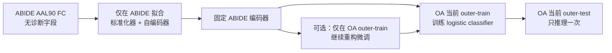

# ABIDE→OA 功能连接迁移学习操作与审计说明

本文档说明如何复现已经完成的 ABIDE 外部自监督预训练、OA 内部迁移评估和
跨运行审计。目标读者是第一次接触神经影像迁移学习的本科生。

## 1. 这次实验回答什么问题

ABIDE 是多中心自闭症数据，OA 是当前骨关节炎疼痛数据。这里不使用 ABIDE 的
ASD/对照标签，而只让模型学习“怎样压缩并重建一张 AAL90 功能连接矩阵”。随后
把这个连接表征用于 OA 患者/对照分类。

它回答的是：**跨疾病、跨站点的大样本无标签 FC 表征，能否改善小样本 OA 的内部
交叉验证表现？** 它不回答神经病理性疼痛诊断、疼痛严重度预测或外部临床有效性。



## 2. 已冻结的数据输入

本机 ABIDE 根目录：

```text
[本机路径已省略]
```

来源是 ABIDE I Preprocessed Connectomes Project 的公开 S3 桶
`s3:/fcp-indi/data/Projects/ABIDE_Initiative/`，预处理管线为 `dparsf`，策略为
`filt_global`。Cyberduck 下载和逐文件审计结果保存在该目录的 `README.md` 与
`manifests/` 中。

模型实际读取两个不含诊断字段的 FC-only NPZ：

| 角色 | 人数 | 文件 | SHA-256 |
|---|---:|---|---|
| 主要外部来源 | 972 | `processed/fc_primary_n972/abide_aal90_fc_pretrain.npz` | `61f6f986…bf5d0` |
| 低运动敏感性来源 | 834 | `processed/fc_low_motion_n834/abide_aal90_fc_pretrain.npz` | `d551ced7…2453` |

两个 NPZ 的 `corr/adjacency` 都是 `n × 90 × 90`，FC 为 Pearson 相关的
Fisher-Z 值，主对角线为 0。n=834 是 n=972 的严格子集。

四类体素导数虽然已经下载并审计，但只有 2 人满足“每个 AAL90 ROI 功能掩膜覆盖
至少 80%”。因此当前外部训练只使用 FC；没有对缺失节点补零，也没有事后降低
覆盖门槛。

## 3. 四条固定比较路线

1. `raw_fc_logistic`：OA 原始 4005 条 FC 边 + logistic regression。
2. `oa_internal_fc_ssl_logistic`：自编码器只在当前 OA outer-train 拟合。
3. `abide_external_fc_ssl_logistic`：标准化器和自编码器只在 ABIDE 拟合，在 OA
   端完全冻结。
4. `abide_external_fc_ssl_oa_finetune_logistic`：从相同 ABIDE 权重开始，只在当前
   OA outer-train 做固定轮数的重构微调。

分类器为类别平衡的 L2 logistic regression。特征选择、分类器缩放和 C 值选择都
位于当前 outer-train 的 3 折内部交叉验证中。outer-test 不参与标准化、预训练、
微调、早停、特征选择、阈值或超参数选择。

## 4. 从烟雾测试到正式运行

在仓库根目录打开 PowerShell：

```powershell
Set-Location "[本机路径已省略]"
uv sync --frozen
```

先验证两个来源文件：

```powershell
$abideRoot = "[本机路径已省略]"
$primary = Join-Path $abideRoot "fc_primary_n972\abide_aal90_fc_pretrain.npz"
$lowMotion = Join-Path $abideRoot "fc_low_motion_n834\abide_aal90_fc_pretrain.npz"
Get-FileHash -Algorithm SHA256 $primary, $lowMotion
```

先执行合成烟雾测试，它不产生正式证据：

```powershell
uv run --frozen python scripts\run_external_transfer_experiments.py --synthetic-smoke
```

再用真实 ABIDE/OA 输入跑一轮 1 epoch 烟雾测试。它仍会执行完整 5 折 × 3 重复，
但输出会明确标记为 `REAL_DATA_SMOKE_ONLY`：

```powershell
uv run --frozen python scripts\run_external_transfer_experiments.py `
  --cohort phase1-n62-primary `
  --source-cohort primary `
  --source-dataset $primary `
  --real-data-smoke
```

烟雾测试通过后，执行四组正式运行。默认是来源/内部预训练 30 epoch、OA 微调
5 epoch、latent dim 32、hidden dim 64、batch size 32、seed 20260810：

```powershell
$sources = @{
  "primary" = $primary
  "low-motion" = $lowMotion
}
$cohorts = @("phase1-n62-primary", "phase1-n64-sensitivity")

foreach ($cohort in $cohorts) {
  foreach ($sourceName in $sources.Keys) {
    uv run --frozen python scripts\run_external_transfer_experiments.py `
      --cohort $cohort `
      --source-cohort $sourceName `
      --source-dataset $sources[$sourceName]
    if ($LASTEXITCODE -ne 0) {
      throw "Formal run failed: $cohort / $sourceName"
    }
  }
}
```

每次运行写入新的 UTC 时间戳目录；如果目录已存在，程序会拒绝覆盖。

### 4.1 复用已经审计的 ABIDE checkpoint

来源自编码器是无标签模型，同一 ABIDE 来源没有必要为每个 OA 目标队列重复训练。
现在可通过 `--source-checkpoint` 直接复用：

```powershell
$checkpoint = "reports\phase1-n62-primary\abide-external-fc-transfer\primary\20260810T001758Z\abide_source_fc_encoder.npz"

uv run --frozen python scripts\run_external_transfer_experiments.py `
  --cohort phase1-n62-primary `
  --source-cohort primary `
  --source-checkpoint $checkpoint
```

程序不会只凭文件名相信这个权重，而会核对来源 NPZ SHA-256、来源受试者集合、
输入边数、latent/hidden 维度、来源训练 epoch、学习率、batch size 和 seed。任一项
不同都会停止。发布新运行时直接复制原 checkpoint 字节，因此源文件与新产物的
SHA-256 必须相同。

## 5. 正式结果

| OA 目标 / ABIDE 来源 | Raw FC | OA-fold SSL | 固定 ABIDE SSL | ABIDE + OA 微调 |
|---|---:|---:|---:|---:|
| n=62 / n=972 | .570 ± .078 | .572 ± .042 | .604 ± .121 | .622 ± .068 |
| n=62 / n=834 | .570 ± .078 | .572 ± .042 | .642 ± .077 | .538 ± .058 |
| n=64 / n=972 | .592 ± .064 | .581 ± .022 | .660 ± .043 | .604 ± .053 |
| n=64 / n=834 | .592 ± .064 | .581 ± .022 | .700 ± .003 | .587 ± .047 |

数值是 3 次重复的完整 OOF ROC AUC 均值 ± 样本标准差。固定 ABIDE 编码器相对
Raw FC 的 AUC 增量范围为 +.034 至 +.108，四个组合方向一致。OA 微调只在
n=62 / ABIDE n=972 中超过固定编码器，在另外三个组合中下降。

这支持下一轮把 **ABIDE n=972 固定编码器**预先指定为主要迁移路线，把 n=834
和微调作为敏感性/消融。不能因为 n=64 / n=834 的 .700 最高，就在看过结果后
把它改成“事先确定的主要模型”。

## 6. 二次汇总审计

本次四个正式运行目录为：

```text
reports/phase1-n62-primary/abide-external-fc-transfer/primary/20260810T001758Z
reports/phase1-n62-primary/abide-external-fc-transfer/low-motion/20260810T001912Z
reports/phase1-n64-sensitivity/abide-external-fc-transfer/primary/20260810T002002Z
reports/phase1-n64-sensitivity/abide-external-fc-transfer/low-motion/20260810T002057Z
```

重新汇总时不要手抄结果；运行审计器：

```powershell
uv run --frozen python scripts\summarize_external_transfer_runs.py `
  --run reports\phase1-n62-primary\abide-external-fc-transfer\primary\20260810T001758Z `
  --run reports\phase1-n62-primary\abide-external-fc-transfer\low-motion\20260810T001912Z `
  --run reports\phase1-n64-sensitivity\abide-external-fc-transfer\primary\20260810T002002Z `
  --run reports\phase1-n64-sensitivity\abide-external-fc-transfer\low-motion\20260810T002057Z `
  --output reports\abide-external-transfer-summary\<新的UTC时间戳>
```

已验证汇总位于
`reports/abide-external-transfer-summary/20260810T003343Z/`，包括 JSON、TSV、
可直接查询的 SQLite 快照和产物哈希清单。

审计器执行以下检查：

- 逐个验证 4 份产物清单和 ABIDE 编码器检查点；
- 从 3,024 行受试者级预测重新计算全部 OOF 指标；
- 复核 180 条来源/适配/测试集合审计，全部交集为 0；
- 同一 ABIDE 来源在 n=62/n=64 中必须得到相同预训练模型哈希；
- 同一 OA 目标下，切换 ABIDE n=972/n=834 不得改变 Raw FC 或 OA-fold SSL
  的预测哈希。

## 7. 每个运行目录中有什么

| 文件 | 用途 |
|---|---|
| `external_transfer_results.json` | 协议、指标、软件哈希、每折表征审计 |
| `external_transfer_predictions.tsv` | 每名 OA 受试者的 OOF 概率和来源哈希 |
| `abide_source_fc_encoder.npz` | 不使用 pickle 的来源编码器与标准化器检查点 |
| `EXTERNAL_TRANSFER_REPORT.md` | 单次运行的人类可读摘要 |
| `artifact_manifest.json` | 上述四个文件的 SHA-256 |

任何结果目录都不可覆盖。代码或数据变化后应生成新目录，并重新运行汇总审计。

## 8. 测试与已知环境限制

```powershell
uv run --frozen pytest `
  tests\test_external_transfer.py `
  tests\test_external_transfer_summary.py `
  tests\test_transfer.py `
  tests\test_transfer_experiment.py `
  tests\test_aal90.py
uv run --frozen ruff check src scripts tests
uv run --frozen python -m compileall -q src scripts tests
```

完整历史测试还依赖当前电脑没有恢复的 `[本机路径已省略]` 原始 DPABI 数据与
`external/BrainHGT` 上游仓库。这些属于已有环境依赖，不是 ABIDE FC 迁移实现的
失败；恢复后再运行全套集成测试。

## 9. 下一阶段

1. 冻结主要比较：ABIDE n=972 固定编码器 vs OA-fold SSL，并同时报告 vs Raw FC。
2. 保持折分和完整嵌套流程不变，进行受试者级标签置换；正式推断至少 1,000 次。
3. 同时报告 AUC、Brier 和校准，不只看一个最高 AUC。
4. 找到带疼痛临床终点、图谱和预处理可对齐的新队列，执行真正的外部测试。
5. 只有新来源数据通过逐 ROI 覆盖门槛后，才重新开启 ALFF/fALFF/ReHo/degree
   节点特征路线。

## 10. 已完成的 checkpoint 复用与置换烟雾测试

新的 n=62 / ABIDE n=972 正式复用运行位于：

```text
reports/phase1-n62-primary/abide-external-fc-transfer/primary/20260810T005557Z
```

它复用了旧运行的 checkpoint；两份 checkpoint 的 SHA-256 都是
`f78a7401f26b82c2a1c116877ecf4b35acc2f1ff037c4b8fab2abb026ae73d14`。
新旧两份受试者级预测 TSV 的 SHA-256 都是
`56c3b1d0c69ca4021994650b5ec6a8bb7cf29b247577d7f2e200f9aa2c586674`，
证明跳过 ABIDE 重训没有改变任何 OOF 预测。

置换脚本的正式用法为：

```powershell
uv run --frozen python scripts\run_external_transfer_permutations.py `
  --run reports\phase1-n62-primary\abide-external-fc-transfer\primary\20260810T005557Z `
  --permutations 1000 `
  --workers 8
```

每个受试者在所有重复折中共用同一个置换标签；标签总数不变，外层折固定。无标签
表征只重建一次并用模型/标准化器哈希核对，但每次置换仍会重新运行内部
StratifiedKFold、缩放、SelectKBest 和 logistic C 值选择。

5 次和 20 次低分辨率运行只用于验证实现与估计耗时。最终已完成 1000 次正式运行，
产物在：

```text
reports/abide-external-transfer-permutations/primary/20260810T012139Z
```

| 对比 | 观察值 | 1000 次中至少同样极端 | add-one p | 角色 |
|---|---:|---:|---:|---|
| 固定 ABIDE − OA-fold SSL AUC | +0.0328 | 357/1000 | 0.3576 | **预登记主要检验** |
| 固定 ABIDE − Raw AUC | +0.0341 | 312/1000 | 0.3127 | 次要 |
| Raw − 固定 ABIDE Brier | +0.0135 | 670/1000 | 0.6703 | 次要 |
| OA-fold SSL − 固定 ABIDE Brier | −0.0168 | 184/1000 | 0.1848 | 次要 |

主要 AUC 增量为正，但在 1000 次随机标签零分布中有 357 次至少同样大；当前数据
不支持“ABIDE 迁移显著优于 OA-fold SSL”的说法。固定 ABIDE 的 Brier 相对
OA-fold SSL 反而更差 `0.0168`，也不能把 AUC 的方向性上升解释为概率校准改善。

审计确认：1000 个受试者级标签向量全部唯一、标签数量保持不变、拒绝重抽次数为
0、45 份折×方法表征全部按模型/标准化器哈希复现。摘要与逐次 TSV 的 add-one
p 值算术以及三份产物 SHA-256 已独立复核。

低分辨率结果不能代替正式结果：

| 运行 | 最低可能 p | 用途 |
|---|---:|---|
| 5 次 | 0.167 | 代码烟雾测试 |
| 20 次 | 0.0476 | 并行/耗时基准 |
| 1000 次 | 0.0010 | 当前正式置换推断 |

本机 i9-14900HX、8 workers 完成正式运行；内存紧张时应先从 2–4 个 worker 开始。
worker 数只影响执行速度，不进入模型或统计定义。

SRPBS 的申请与获批后数据契约见
[`SRPBS_ACCESS_AND_CONTRACT.md`](SRPBS_ACCESS_AND_CONTRACT.md)。

当前所有结果仅供研究使用，不能作为临床诊断或治疗决策依据。
