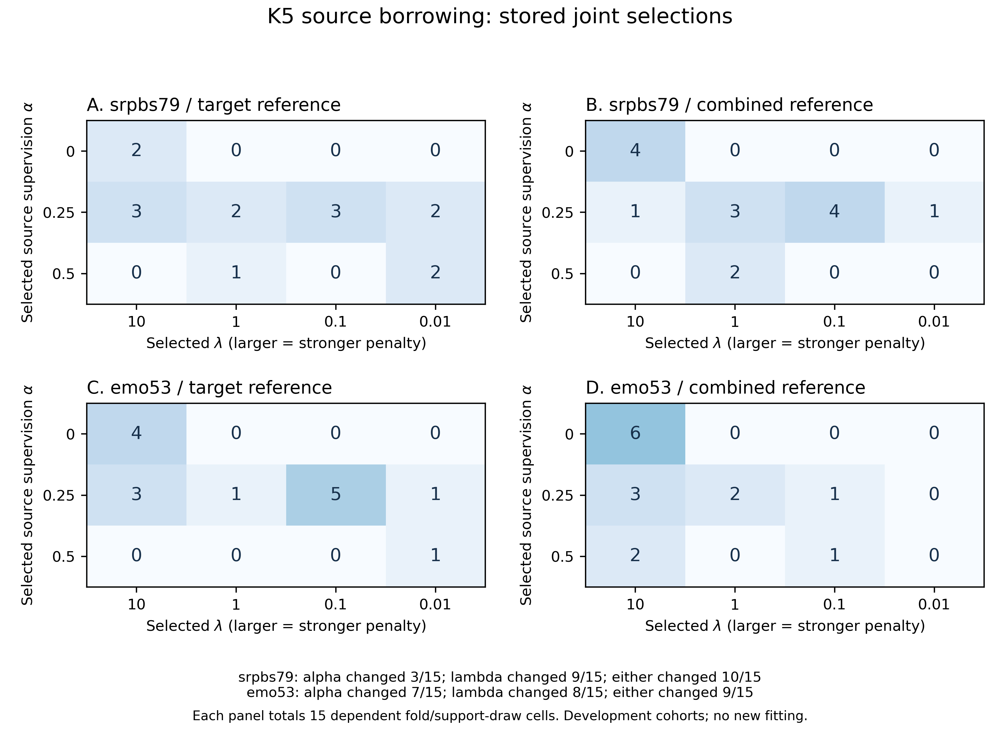

# 强FC参考估计与来源权重：保存选参的补充复查

2026-10-04。本次读取已完成6516头实验的原K5选参和预测，补充解释参考变化与正则选择的关系。没有重新拟合、查询驱动选参、QC纳入或独立临床验证；原四项主要比较和区间保持。

同一批目标支持者改用来源与目标联合参考后，SRPBS有10/15个折—支持抽样单元改变了α或λ，Emo有9/15个改变。因此，原自适应参考对照反映整个处理与选择流程的变化，不能把AUC差全部归因于参考几何。

## 同一支持者下，哪些选择发生变化

原设计固定三外层折、五次支持抽样，每类5名目标支持者。各方向15个单元相互相关，次数只作描述；它们不是15名新患者或独立二项试验。α是来源监督的总权重，λ是平均损失尺度下的正则强度。

| 目标 | α改变 | λ改变 | 至少一项改变 | 两项均保持 | 原联合参考减目标参考ΔAUC及描述性95%区间 |
| --- | --- | --- | --- | --- | --- |
| SRPBS79 | 3/15 | 9/15 | 10/15 | 5/15 | −0.0004 [−0.0315, 0.0275] |
| Emo53 | 7/15 | 8/15 | 9/15 | 6/15 | −0.0553 [−0.1958, 0.0362] |

最后一列直接沿用原先已报告的K5次要参考对照及其配对经验区间，未重新计算区间。两项区间均跨零；不能把Emo的负点差写成已确认的参考损害。改变次数没有p值或新置信区间。

## α与λ的联合选择

每幅图合计15个相关单元。横轴为所选λ，越大表示标准化坐标中的惩罚越强；纵轴为所选来源监督α。数字是原内层规则已经作出的选择次数。本次没有根据查询AUC重新挑选参数或支持者。

零来源监督在SRPBS的目标/联合参考下分别为2/4个单元，Emo分别为4/6个。Emo选择λ=10的次数由7增至11，但α也改变，不能由此判定“更强正则导致成绩降低”。联合参考下即使α=0，切空间仍使用无监督来源几何，不能称完全没有借用来源信息。

## 平均损失控制覆盖什么

原运行对来源与目标分别做类别平衡，所有监督样本权重和为1；来源总质量为α，目标为1−α。所用λ候选为10、1、0.1、0.01，代码设置C=1/λ。因此，新增来源人数不会仅通过监督权重和变大而自动减弱平均损失尺度上的惩罚。

λ定义在每个模型按训练权重标准化后的坐标中。α变化也会改变训练均值和尺度，切空间参考改变会改变表示，内层还会重新选择λ。权重和相同并不意味着原始FC坐标中的有效惩罚、最终系数或预测相同；liblinear的合成截距仍受原惩罚。当前结果支持对整个受控流程作比较，尚不足以拆出某一独立生物或几何机制。

固定α的参考比较也重新选择λ。若未来确需区分固定分类器的几何效果，应另设有明确科学问题的有限实验；本轮不追加配置、不改变原协议或用旧查询集搜索机制。

## 协变量负对照与原件核对

同一支持者在目标/联合参考下的90组协变量候选记录逐字段相等。四种监督方法、两个方向共120对保存协变量预测均完全一致，覆盖2,640个配对概率值，最大差0。协变量不使用切空间，因此这个结果支持本次参考变化没有意外改变协变量选择或保存预测；它不能证明FC的变化具有临床意义。

本次实际读取34个原件，共2,927,901字节，与既有服务器归档逐字节读回相等：30份K5选参、任务表、原独立复算记录、保存预测及原聚合。按原代码的12位舍入和平分顺序重放选择，60项自适应FC选择的边际次数全部复现原公开JSON。原724最终头及5792内层头的独立概率复算误差0仍作为原实验来源证据，不把本次次数复查冒称再次重算全部模型。

## 论文与剩余目标

这项事后复查补充[强FC来源借用实验](fc-transfer-conditions-20261002.md)与[逐折一致性分析](fc-fold-robustness-20261003.md)。SRPBS与Emo均已参与开发，旧主要正负结果及其支持抽样和身份限制保持；没有新预训练优势或临床有效结论。近期论文的病种、输入和评价比较继续见[文献比较](migraine-input-pilot-20261002-literature.md)。

继续完整132人偏头痛候选的真实输入和必要复核，再按原有限方案比较强FC、冻结288维、随机及协变量。诊断、扫描同期程度和治疗反应的独立临床增量仍需真实临床参照、时间、身份和未参与开发的测试数据。TN14、结构535及其他停止/暂停边界、原标签、QC和划分不变。

[全部聚合JSON](fc-reference-selection-20261004-summary.json) · [联合次数CSV](fc-reference-selection-20261004-joint.csv) · [参数转移CSV](fc-reference-selection-20261004-transitions.csv) · [图PNG](fc-reference-selection-20261004-figure.png) · [矢量图SVG](fc-reference-selection-20261004-vector.svg)

<!-- fc-objective-review-20261004 -->
## 10月4日：加权目标与有效正则的保存模型复查

10月4日重算6516个保存头的加权损失、L2正则和梯度，全部保存概率复算误差0。最终FC头的最大优化目标差上界估计4.24×10⁻⁶；它约束训练目标，不能换算为AUC或临床增量。原主要结果与选择保持，没有新拟合。

全部6516头梯度相对初始梯度的最大比值约4.99×10⁻⁵；独立logloss函数差4.44×10⁻¹⁶。权重和1控制平均损失总量，训练加权标准化仍改变原特征坐标的惩罚；不能把整项迁移差异归因于单一正则机制。目标差上界按浮点梯度估计，未作区间算术认证。[完整报告与全部条件聚合](fc-objective-review-20261004.md)。

<!-- fc-target-scaling-20261004 -->
## 10月4日：固定目标标准化的实际新拟合

10月4日固定目标训练均值与尺度后，K5目标参考自适应AUC为SRPBS79 0.7088、Emo53 0.5456；相对原策略差值-0.0172、-0.0225，两项配对95%区间均包含0。实际4320新拟合、2196原头复用，全部6516保存头独立复算。已有队列事后开发分析，候选分类与新增独立临床验证仍0。

两方向主要新旧配对差值区间分别为[-0.0548, 0.0184]与[-0.1211, 0.0601]，不能主张稳定改善、显著恶化或等效。同参考、同训练折的目标类平衡μ/s固定；实际λ及α仍由原内层选择规则决定，比较整个策略。全部68条件、原四项来源/目标参照、选择计数及保存目标残差同时报告；来源/目标单独原参数与概率保持。不沿本次查询扩展搜索；完整132偏头痛输入及必要身份/临床/质量核查后的原四方法对照、未开发临床三终点和论文终稿继续。全部旧阴性/QC/标签/划分、原20未评分及TN14/结构535/CLIP停止保持。[完整结果与方案](fc-target-scaling-20261004.md)。
