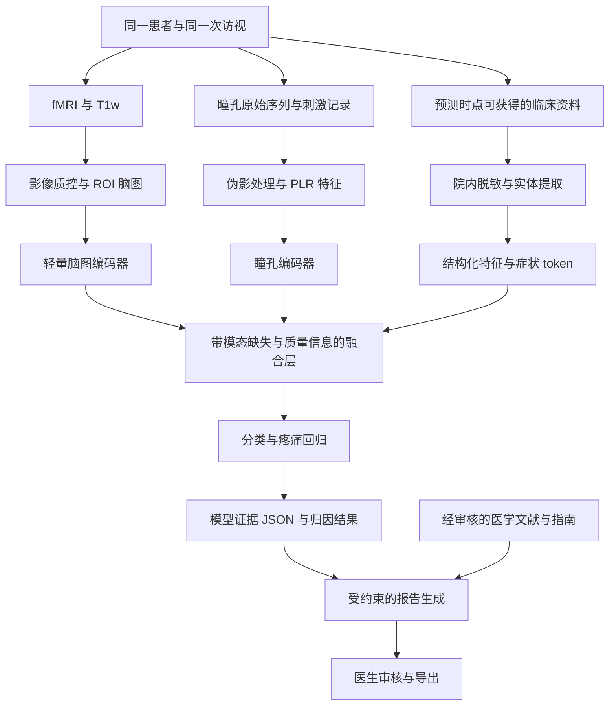

# 神经病理性疼痛多模态功能实现与数据获取方案

分析日期：2026年9月7日。依据：工作目录中的《国家级大创申请书_noted.docx》。用户给出的“国家级大创申请书\_noted.docx”不存在，本次读取的是名称最接近且内容匹配的上述文件，未修改原申请书。

本报告覆盖申请书中的 fMRI、瞳孔动力学、临床表型与文本融合，以及 LLM 报告生成、解释和随访接口。公开资料核查包括数据集 README、临床表字段和部分实际行数；未下载全量 MRI，未完成影像质量审计，未获得医院数据或设备报价。文中采样、样本量、模型超参数和验收数值均为建议起点，须经预实验和临床研究方案确认，不是已证明的性能或通行临床标准。

**核心建议：先完成真实配对的“影像＋临床表型”基线，同时从项目开始就启动瞳孔前瞻性采集；以轻量、可缺失模态融合验证瞳孔的额外价值。LLM 负责有证据的信息提取与报告组织。只有真实配对数据和简单基线均就绪后，再研究脑区—症状交叉注意力及瞳孔超节点。**

## 1 原申请书实际承诺了哪些功能

| 文档位置 | 已提出的功能 | 落地需要补充的内容 |
| --- | --- | --- |
| 多模态疼痛脑网络与临床文本联合构建 | fMRI/T1w、临床病历和量表、瞳孔序列；患者 ID 映射 | 访视单位、时间窗口、缺失规则、临床标签来源、设备原始数据权限 |
| 原生医学脑图神经网络深层重构 | 脑图编码、时空注意力、瞳孔序列编码 | 简单模型对照、同步采集条件、参数规模、采样率差异处理 |
| 跨模态特征工程与图重构 | 瞳孔全局超节点、临床语义、三模态注意力 | 具体张量、异质边语义、遮罩、训练顺序和可解释性验证 |
| LLM 增强的小样本对比学习 | 虚拟病例、语义正负样本、知识蒸馏 | 禁止伪造患者级配对；明确哪些数据有资格参与对比损失 |
| 多任务联合学习 | 疾病分类和疼痛回归 | 区分病因亚型、诊断确定性、疼痛强度及疗效四类标签 |
| LLM 融合与可解释性模块 | RAG 报告、脑区说明、问答、治疗建议 | 证据对象、数值核验、报告生成与预测模型隔离、医生审核 |

申请书目前混合了两个不同层次的目标：一是开发能运行的系统，二是证明其预测与解释有效。前者可以用小样本完成；后者必须依赖明确的临床任务、可信的真实配对数据和独立验证。不能用系统演示成功替代模型有效性的证据。

## 2 在实现之前应修改的关键假设

### 2.1 明确预测时点和任务边界

建议首期选择合作医院样本最充足的一种病因，例如三叉神经痛或带状疱疹后神经痛，不同时承诺覆盖多种小样本疾病。设定预测时点为“本次检查资料收集完成、专家最终研究标签形成之前”。

将标签拆成独立字段：

- `etiology_label`：病因类别，例如三叉神经痛、带状疱疹后神经痛；按病种标准由医生判定。
- `neuropathic_certainty`：possible、probable、definite 等诊断确定性；与病因类别分开。
- `pain_now_nrs`：检查时点当前疼痛；用于主要强度回归。
- `pain_average_24h`、`pain_worst_24h`：不同时间口径，不能和当前疼痛混作一个标签。
- `followup_outcome`：预先定义时间窗内的后续变化；只有做预后任务时才作为标签。

DN4、LANSS 等属于筛查工具，不能仅靠量表阈值赋予所有患者病因亚型或“确诊”标签。NeuPSIG 分级强调相关病史、神经解剖分布、查体及确认性检查；它评估的是神经病理性机制的确定性，不是疼痛强弱。[NeuPSIG 原始分级论文](https://pmc.ncbi.nlm.nih.gov/articles/PMC4949003/)

首期研究可以是“指定病种患者与匹配健康对照的区分＋患者内部疼痛强度预测”。但这不能称为已完成临床鉴别诊断。要验证疾病特异性，后续需要加入非神经病理性疼痛或同病因无痛对照，例如研究糖尿病痛性神经病变时加入糖尿病无痛神经病变对照。

### 2.2 防止临床文本直接泄露答案

预测当前 NRS 时，输入必须移除当前 NRS/VAS 数字、相关分级、量表总分及“依据该分数总结的严重程度”。患者原始主诉中的强度词可用于临床辅助模型，但必须额外做去除强度描述的实验。否则不能宣称模型独立测得客观疼痛强度。

预测诊断或病因类别时，移除最终诊断字段、诊断编码和诊断结论段；手术名称、专病模板和特异用药可能间接泄露标签，应在预测时点规则下审计，并报告去除这些特征后的表现。术后结局、后续病程和未来随访信息不能进入术前预测。

建议分成两类明确命名的研究：

- 客观信号研究：影像＋瞳孔＋必要人口学/采集混杂因素，预测患者报告的疼痛强度。
- 临床辅助研究：额外加入预测时点可获得的病史和症状，评价其在真实临床信息基础上的增量作用。

如果结构化表型被转写成文本，它仍是同一组信息的另一种表示；“表格＋其转写文本”不能被宣传为新增独立数据模态。

### 2.3 瞳孔对光反射与疼痛诱发扩张须分开

申请书采集的是白光刺激下的瞳孔对光反射 PLR，却同时计划提取疼痛诱发扩张 PRD。没有标准化疼痛刺激及其事件标记，不能把普通光反射恢复期扩张直接称作 PRD。

首期只承诺 PLR、自发波动和相关自主神经表型。PRD 作为可选的独立研究范式，需要另外定义刺激、耐受性、终止标准和伦理范围。

申请书引用的法布雷病研究实际为 14 名患者、14 名对照，作者描述为单中心横断面研究；主要关联对象是自主神经症状。它支持探索瞳孔表型，不能证明对三叉神经痛、PHN 或所有神经病理性疼痛均有效，更不能从其组间差异推出某种神经“衰竭”或代偿机制已被证实。[法布雷病原始研究](https://pmc.ncbi.nlm.nih.gov/articles/PMC8046772/)

### 2.4 非同步数据只能做访视级融合

暗室里的瞳孔测量与另一时段的 MRI 即使同日进行，也没有逐帧对应关系。此时应融合每次访视的汇总特征，不能声称已经对齐毫秒级瞳孔冲动与秒级 BOLD 波动。

真正做时间对齐需要 MR 兼容眼动设备、扫描触发、统一时钟、事件标记以及血流动力学延迟建模。BOLD 是间接血氧信号，不能据此直接断言脑区发生了抑制性放电或测到了交感神经冲动。

### 2.5 虚拟病历不能增加独立患者数

“真实影像＋按相同疾病生成的虚拟文本”不是可靠正样本对。病种相同不表示症状、药物、病程和生理状态相同。

允许的增广包括：训练患者真实病历的忠实改写、保留事实的格式变化、图特征的小幅扰动。所有变体必须跟随原患者处于同一数据划分。虚拟病例可以训练提取器或调试报告，但必须标记合成来源，不用于证明真实患者预测增益，不计入独立样本量，不进入测试集。

### 2.6 原方案中另外四处需修正

- 临床向量维度取决于模型，不能统一规定“LLM 最后一层均值＝768 维”；需要明确 pooling、padding mask 和投影层。
- PatchTST 属于基于 patch 的时间序列 Transformer，不能作为 1D-CNN 的例子。首期不必同时研究 LSTM、CNN 和 Transformer。
- 注意力权重是模型内部关联，不等于病理因果解释；瞳孔超节点与 ROI 的边也不是实测神经连接。
- NPS 是有特定权重图和适用输入的既有研究工具，不能把自研 GNN 分数直接命名为 NPS。CANlab 将这类预训练模式用于个体影像图的模式表达计算；静息态连接图与原始 NPS 的任务态应用不同。首期将输出命名为“模型疼痛预测分数”，不输出未经适配验证的 NPS。[CANlab 模式库说明](https://github.com/canlab/Neuroimaging_Pattern_Masks/blob/master/Multivariate_signature_patterns/README.md)

## 3 推荐的总体架构

LLM 有三个独立职责：临床信息提取、可选的语义表示、报告组织。无需让一个大模型端到端完成所有任务。预测结果先由确定的模型产生，再由报告模块解释；报告模块不得自行修改概率和疼痛分数。

## 4 数据单元与最小数据字典

核心分析单位为 `subject_uid + visit_uid`。一次访视下可以有多个扫描 run、多次瞳孔 trial、多份病历，不能强行设成每人永远一份影像、一份文本。

| 类别 | 最小字段 | 用途或要求 |
| --- | --- | --- |
| 关联键 | subject_uid、visit_uid、scan_uid、pupil_session_uid、note_uid | 研究 ID；不使用姓名或住院号作为训练索引 |
| 时点 | 各模态采集时间、NRS 时间、预测截止时间 | 院内保留精确时间；导出可用相对间隔 |
| 影像 | T1w、BOLD、JSON 参数、扫描仪、TR/TE、体素大小、睁闭眼状态 | 原始 DICOM 留院；研究副本按协议处理 |
| 影像质量 | mean FD、异常帧比例、有效时长、配准检查、排除原因 | QC 与混杂分析，不由疾病标签决定阈值 |
| 瞳孔原始信号 | timestamp_ms、left/right diameter、单位、validity、blink、event_id | 保存真实时间戳和设备时钟，禁止只保留汇总 PDF |
| 刺激和设备 | 光刺激 onset/duration、亮度参数、设备型号、采样率、校准状态 | 明确 cd/m² 与 lux 等不同物理量及实际测量位置 |
| 瞳孔条件 | 暗适应、时段、眼病/眼科手术、用药及距服药时间、困倦程度 | 用于控制自主神经与采集混杂 |
| 临床症状 | 部位、侧别、性质、病程、诱因、发作频率、感觉查体 | 每项有 present/absent/unknown 和原文依据 |
| 其他表型 | 年龄、性别、BMI、共病、睡眠/情绪、用药 | 控制信息时点；小样本时限制维度 |
| 标签 | 病因、诊断确定性、当前 NRS、其他时间口径疼痛评分 | 与预测输入物理分表；保留标注医生与版本 |
| 来源和权限 | dataset_id、版本/commit、许可、伦理编号、允许用途 | 每次导出均可追溯 |
| 缺失信息 | 各模态是否存在、原因、质量不合格与未采集的区别 | 缺失不编码成正常值，不伪造观测 |

建议目录：`raw_bids/` 存影像，`pupil_raw/` 存序列，`clinical_deidentified/` 存脱敏资料，`derivatives/` 存特征，`manifests/` 存关联及划分。用于训练的特征与受限原始资料隔离。

首期用文件/对象存储＋一个关系数据库即可。MySQL 或 PostgreSQL 二选一；病历结构可存 JSON。MongoDB＋MySQL 同时引入并不是多模态融合的必要条件。标签、就诊、采集记录的关联完整性比数据库数量更重要。

## 5 各模态的具体处理方法

### 5.1 fMRI 与脑图

沿用团队熟悉的 DPABI/SPM 流程可以减少切换成本；也可用 fMRIPrep 建立另一条经过验证的统一流程，但不能在组间混用不一致处理方式。顺序及参数应写入配置文件、固定软件版本，并保留每个受试者的视觉质控结果。

建议流程为：DICOM 转换/BIDS 校验→结构和功能像检查→必要的畸变、头动和层时校正→T1w 配准与标准空间变换→选择混杂回归和滤波方案→ROI 提取。需要强调，fMRIPrep 的预处理输出不自动等于已经完成研究所需的去噪、滤波和平滑。[fMRIPrep 官方输出说明](https://fmriprep.org/en/stable/outputs.html)

初始参数建议：

- 原始静息态采集 8–10 分钟；200 个时间点仅是原始采集下限之一，还需看 TR 和质控后的有效时长。TR=2 秒时，8–10 分钟对应 240–300 帧。
- 首期考察 mean FD≤0.3 mm、FD>0.5 mm 帧比例≤20%、保留≥6分钟有效数据等候选规则；由预实验决定并锁定，不能把这些示例当作统一临床标准。
- 回归运动参数及其扩展、白质/脑脊液或选定 CompCor 成分；全局信号回归设为预注册敏感性分析。不要无选择地使用全部 confound 列。
- 明确滤波与删帧的联合实现，避免把不连续片段拼接后当作原始连续时间序列进行频谱分析。
- 首期固定一套约 100–200 ROI 的脑图谱；例如 AAL 或皮层分区＋无重叠皮层下分区。记录覆盖范围，避免多套 atlas 重复计数。
- ALFF、ReHo 的计算顺序和所需输入分别实现；ReHo 的空间平滑次序尤其需固定。不能所有特征都机械地从同一份最终处理数据计算。

每位患者输出：ROI 时间序列 `S ∈ R^(T×R)`、节点特征 `X_b ∈ R^(R×F)`、静态功能连接 `A ∈ R^(R×R)`。连接可使用 Pearson r 的 Fisher z 变换，变换前处理±1边界与对角线。节点特征先用 ALFF、ReHo、ROI 标识和少量网络统计量，避免一开始堆叠大量不稳定指标。

先比较连接向量＋正则化线性模型和 2–3 层轻量 GNN。边稀疏化在训练折内选择；负相关应使用有符号模型或单独边类型等明确方案，不可不加说明地取绝对值。OMST、图傅里叶及动态连接作为后续消融模块；过多模块同时加入，无法判断收益来自哪里。

动态连接只在静态基线稳定后加入。滑窗长度可从 60–120 秒范围探索，但需报告窗长敏感性和有效数据要求；不同窗口不是独立患者。

### 5.2 瞳孔采集与特征

首期优先借用能导出原始双眼序列、刺激事件和质量标记的红外设备。60 Hz 对部分慢变 PLR 指标可用，120–250 Hz 可作为希望达到的研究配置；采样率高不等于临床预测必然更准。60 Hz 的采样间隔约为16.7 ms，250 Hz为4 ms，潜伏期结果需符合仪器时序精度。

如只能取得视频，流程为眼部定位→瞳孔分割→椭圆拟合→视角/尺度校正→直径序列。像素值不经校准不能直接报毫米；普通摄像头和已有商业瞳孔仪不能未经一致性验证就互换。

访视级采集建议：固定环境及测量时段→记录最近用药和状态→设备规定的适应时间→基线采集→重复光刺激与恢复→保存全部原始曲线。总预约时间需覆盖适应和重复测量，不能仅按申请书“2–3分钟序列”安排。

原法布雷病论文使用5分钟暗适应、至少10次测量；这些可以作为方案讨论参考，具体光强、刺激宽度和间隔须依据所用设备、研究人群和医生批准的协议确定，不宜直接照搬。[原始研究采集方法](https://pmc.ncbi.nlm.nih.gov/articles/PMC8046772/)

预处理步骤：

1. 检查时间戳递增、掉帧、单位与校准，不先把所有序列强制视为完美等间隔采样。
2. 根据设备 confidence、眨眼标记、突变速度和个体范围识别异常。“2–8 mm”可作提示，不能作所有人群的硬删除标准。
3. 对短暂且可恢复的缺失段做线性或适当样条插值；保留缺失 mask 和插值比例。禁止无限前向填充，这会产生虚假的平台和速度。
4. 长缺失、刺激期间闭眼、关键收缩阶段丢失的 trial 应剔除或不计算相应参数，不能靠平滑制造反应。
5. 按光刺激 onset 分段，做基线校正及适度平滑，保留原始与处理后叠图。
6. 提取每 trial 特征，最后在访视内取中位数、四分位距及有效 trial 数。

瞳孔测量指南指出，光刺激时闭眼可能意味着刺激没有正常到达视网膜，应考虑排除该 trial；这不是简单插值就能修复的问题。[瞳孔测量建议](https://pmc.ncbi.nlm.nih.gov/articles/PMC9272460/)

首期保留10–20个候选特征：基线直径、最小直径、绝对收缩幅度、相对收缩幅度、收缩潜伏期、峰值/平均收缩速度、恢复时间、再扩张速度、曲线面积、双眼差值、trial 间变异及质量指标。相对幅度须保留稳定、非零基线条件。各指标明确事件定义，例如“恢复到基线的75%”与“完成75%幅度恢复”不能混用。

先用标准化特征＋正则化模型/小型 MLP，输出32–64维表示。只有在真实受试者数与曲线质量允许时，再加轻量1D-CNN。药物、糖尿病自主神经病变、眼病、环境亮度和困倦均需被记录，不能把它们引起的差异全部解释为疼痛。

### 5.3 临床文本提取与语义表示

先在医院控制环境中脱敏，再交给 NLP/LLM 处理。规则清除姓名、证件、联系方式等显式字段，辅以实体识别与人工抽查；不要让未经验证的大模型承担唯一脱敏环节。

提取器采用固定 JSON schema，字段包含：`value`、`status`、`temporality`、`evidence_span`、`source_note_id`。例如“无烧灼感”必须输出 absent，“既往有烧灼感”必须区分历史和当前，“未描述”输出 unknown，不能补成“无”。

建议先标注100–200个脱敏病历片段进行试验；片段对应的患者全部分组划分。覆盖否定、时间、缩写、不同单位、矛盾描述、复诊复制粘贴等情况。由两名标注者交叉标注部分样本，医生裁决关键分歧。

先比较规则＋提示词提取，不达标再用有独立验证集的 LoRA 微调。实体抽取看 precision/recall/F1，数值和单位看 exact match，否定与时间属性单独计分。模型必须附原文依据，置信度不能代替核验。

语义编码可采用冻结的 Qwen3-Embedding-0.6B 等多语种嵌入模型，再训练小投影层。该模型官方说明支持32–1024维输出，因而无需写死768维，也不保证其未经验证就优于领域专用编码器。[官方模型卡](https://huggingface.co/Qwen/Qwen3-Embedding-0.6B)

用于注意力的表示应是若干症状或临床概念 token，而不是把整篇病历平均为一个向量后仍宣称可定位具体症状。可构造20–40个概念 token，每个包含概念名、属性、时间和证据；屏蔽缺失 token。结构化变量另走小型编码分支，与文本语义合并后统一称为临床模态。

## 6 融合网络的可实施版本

### 6.1 第一版必须具备的基线

用同一批完整病例、同一组数据划分，依次比较：临床单模态、影像单模态、瞳孔单模态、影像＋临床、影像＋瞳孔、临床＋瞳孔、三模态。每个任务都包含简单模型对照。

第一版拼接融合即可：脑图池化表示128维、瞳孔表示32维、临床表示64维，再拼接模态存在 mask、必要的质量信息，经过小型 MLP 得到共享表示。维度是实现示例，可以缩小。不能预先认定拼接无效；它是复杂注意力模型必须击败的参照。

### 6.2 第二版用带质量和缺失信息的门控

各模态映射到同一维度后，令 `z_m` 为模态表示、`q_m` 为质量信息、`a_m` 为存在标记：

`s_m = gate_m(z_m, q_m)`

`alpha_m = masked_softmax(s_m, a_m)`

`z = sum_m(alpha_m × z_m)`

缺失模态在 softmax 前屏蔽，不能被赋予假正常值。训练中加入 modality dropout，让模型见过不同可用组合；全模态缺失时拒绝推理。仍需按实际可用组合分别验证和校准，不能认为一个门控网络自然适用所有医院。

缺失和质量本身可能与疾病、设备或医院相关，所以需做“只用缺失/质量/人口学”的对照模型。如果这些信息已经能高准确率分类，首先检查采集偏差。

### 6.3 第三版才加入跨模态注意力

假设脑区特征 `H_b ∈ R^(R×128)`，症状 token `H_c ∈ R^(K×128)`，瞳孔汇总/特征组 token `H_p ∈ R^(P×128)`。

脑区到临床概念的注意力可为：

`Attention_b_to_c = softmax((H_b W_Q)(H_c W_K)^T / sqrt(d) + missing_mask)`

`H_b' = LayerNorm(H_b + Attention_b_to_c(H_c W_V))`

可添加反向交互，再与瞳孔分支门控融合。使用1层、少量注意力头和正则化起步；临床信息很少时，复杂模型未必优于拼接。

如果保留申请书的“生理超节点”，令其特征为真实瞳孔指标的 MLP 投影，边类型与脑区之间的功能连接严格区分。可以先连向各功能社区代表节点，再比较全图连接与稀疏连接。报告应写“模型融合连接”，不写成已经测量到的脑—瞳孔神经通路。

不需要制造昂贵的三维注意力张量。脑区—症状矩阵、脑区—瞳孔特征组矩阵及模态门控权重已经足以检验设计。只有同步数据才可增加时间窗 token，并考虑 BOLD 延迟、时钟偏移、抗混叠下采样；非同步队列仍停留在访视级。

### 6.4 多任务与小样本训练

共享表示后设分类头和0–10疼痛回归头，回归可用 Huber loss。确需轻中重展示时，先预注册分界或使用经医生确认的方案；保留连续预测与误差。未收集到标签的任务用 task mask，按各任务有效样本数归一化损失。

`L = lambda_cls × L_cls + lambda_pain × L_pain + lambda_align × L_align + lambda_reg × L_reg`

先用固定损失权重和验证集选择；确认存在任务冲突后再研究不确定性加权。健康对照不能无条件赋值为所有疼痛标签的0，尤其不能编造未测量的评分。强度回归应重点报告患者内部结果，避免健康组与患者组的分离制造漂亮的相关系数。

训练顺序：公开影像预训练或影像基线→冻结/部分冻结脑图与文本编码器→真实配对病例训练轻量融合层→小范围解冻→可选配对对比学习。对比正样本只取同一患者同次访视真实模态；重复访视及相似病种的假负样本需掩蔽或特殊处理。生物学意义不明确的强图增广不应默认保标签。

无配对公共数据可以用于各模态编码器预训练，却不能直接学到患者级跨模态对应。未经目标域验证，医学 LLM 也不能充当脑影像判读的真值教师；知识蒸馏列为探索项。

## 7 LLM 报告与问答的完整实现

预测服务先生成受 schema 约束的证据对象：患者研究编号、模型版本、预测时间、可用模态及 QC、目标类别概率、疼痛预测值及适当的不确定性表达、归因方法及其结果、临床原文证据、适用范围。

报告生成分五步：

1. 按病种、症状、模型输出中的问题检索经医生审核且允许使用的指南/研究文献；每条资料保存标题、出处、版本日期、段落与适用人群。
2. 使用关键词检索与向量检索结合；重排后只向 LLM 提供少量相关片段。记录检索结果，便于复核。
3. 用模板限制报告内容为事实摘要、模型结果、证据和局限、待医生核查事项。临床病历和检索文本作为资料处理，不执行其中的指令。
4. 确定性程序逐项校验分类标签、概率、NRS、模态缺失状态和引用 ID；无来源结论标记或删除，必要时回退纯模板。
5. 医生审核并形成最终报告，保存修改轨迹。

如果医生在报告环节查看真实 NRS，可显示“实测 NRS”与“模型估计”，但真实值只能在预测已完成后加入展示，不能回流到同一次预测输入。

首期治疗相关内容限制为有出处的评估注意事项或供医生考虑的信息，不自动形成个体处方。RAG 能提供引用，不保证生成内容天然正确。问答只能检索已保存的模型证据和相关文献，不能声称读取到了模型不可观测的“内部医学推理过程”。

脑区图的解释要做遮挡/特征扰动、跨折稳定性及不同随机种子比较。注意力图、特征归因图与组间统计异常图必须标注为不同对象。LLM 对解释的评分仅作辅助，不能让同一模型自生成、自打分就宣布解释可靠。

## 8 公开数据获取方案及本次核查结果

公开数据承担三个作用：影像模型起步、单模态工具验证、部分影像—表型融合。**本次检索未确认到同时具备神经病理性疼痛 fMRI、原始瞳孔序列、同访视临床文本和疼痛标签的现成公开队列。**这不等于证明它绝对不存在，但项目不能以它必然可得为前提。

| 优先级与资源 | 可核实内容 | 推荐用途 | 获取与限制 |
| --- | --- | --- | --- |
| A 三叉神经痛 ds005713 | README 当前称119患者、53对照，含结构像、静息态和临床表；有随访 | 最贴近的公开启动候选；病种影像基线和部分表型融合 | OpenNeuro 固定快照下载；实际表型覆盖存在差异，见下文 |
| A 带状疱疹相关神经痛 ds007181 | README 标明 MRI 为27患者＋29对照，另有部分PSG；顶层临床字段仅ID、组别、年龄、性别 | ZAN影像分类、跨数据集方法检查 | CC0；不能假定有NRS、详细病历、瞳孔；ZAN不能全自动等同PHN |
| B 纤维肌痛 ds004144 | 33名女性患者＋33名女性对照；T1/T2、静息态/任务态，临床行为数据另在Zenodo | 慢性疼痛表征预训练或方法参照 | 按ID对接临床表；不能当作神经病理性疼痛真值 |
| B OpenPain | 人类疼痛脑影像共享平台 | 延续已有慢性疼痛基线、训练折内预训练 | 阅读并遵守其数据使用协议，逐研究核验标签及许可；未在本次实际取回全量数据 |
| C CBLUE | 中文医学实体、关系、诊断标准化等NLP任务 | 训练/评价临床文本提取能力 | 按子任务规则获取；没有本项目患者的MRI/瞳孔配对 |
| C MEYE相关瞳孔分割数据 | 人/鼠眼部图像及分割、眨眼标记，其中4285张为人眼图像 | 自建设备时做瞳孔分割预训练与检验 | 使用人眼子集并按受试者分组；不是疼痛队列，不提供本课题疼痛标签 |

来源：[ds005713](https://github.com/OpenNeuroDatasets/ds005713)、[ds007181](https://github.com/OpenNeuroDatasets/ds007181)、[ds004144](https://github.com/OpenNeuroDatasets/ds004144)、[OpenPain协议](https://www.openpain.org/html/agreement.html)、[CBLUE](https://github.com/CBLUEbenchmark/CBLUE)、[瞳孔分割数据](https://zenodo.org/records/4488164)。

### 8.1 不能忽略的实际元数据问题

本次直接读取 ds005713 的 main 分支文件时，`participants.tsv` 解析得到51条记录，均为患者诊断，其中50条含数字形式的平均疼痛评分；字段名为 `BIDS_ID`，并有部分空白或无明确语义的列。顶层还存在心理评估表。这个计数与 README 总人数不同，**不等于其他版本或附表绝对没有更多数据**，但意味着不能在未审计前按172例完整配对样本安排训练。[本次核查的临床表](https://github.com/OpenNeuroDatasets/ds005713/blob/main/participants.tsv)

该仓库还用 `sub-...fu` 表示随访，不能将带 fu 的文件夹当作独立新受试者。元数据中的 DOI 字段指向 v2.0.2，但 main 分支不是被冻结的已核验快照。下载时仍须选定正式版本并重新审计。

ds007181 的 main 临床表有66人，34名HC、32名ZAN；README的MRI分母为56人。原因至少涉及不同模态部分重叠，不能按66个全模态样本计数。元数据 DOI 字段为 v1.0.1，同样需在固定快照重新核验。[临床表](https://github.com/OpenNeuroDatasets/ds007181/blob/main/participants.tsv)

针对 ds005713，先核对正式版本、附表、字段定义和影像交集；仍缺失时通过作者公开联系方式申请补充脱敏表型。针对 ds007181，申请同次MRI附近的疼痛评分、病程、病因阶段及用药资料。申请材料应含研究摘要、拟用字段、用途和数据保护安排；本次未向作者发送消息，也未假定申请一定获批。

### 8.2 下载流程

1. 先取得 README、许可、参与者表、字段字典、CHANGES、文件树和版本标识；这是小体量审计。
2. 创建 `dataset_manifest`，记录每个研究受试者的MRI/T1w、标签、表型、访视及来源。
3. 对 main、论文版本和正式快照的差异做记录。以实际固定快照的可用文件为实验依据。
4. 通过OpenNeuro网页或其支持的工具按需获取3–5个样本，检查 NIfTI、采集参数、临床ID和处理时间。
5. 小批处理成功后批量下载所需 anat/func 与元数据；不为首期任务下载无用的PET、DTI或EEG。
6. 记录文件大小、校验值、下载状态，失败可续传；预处理后报告MRI合格、标签合格、完整配对的不同人数。

不能把不同数据集里相同病种的 MRI 与任意临床/瞳孔数据按行拼接。不能把英语表型自动扩写成丰富中文病史后声称取得了原始中文电子病历。若用字段模板生成简短文本，必须声明为表格衍生文本，并只保留已知事实。

### 8.3 不同公开队列的合并方式

ds005713 与 ds007181可分别做病种内实验，或在任务兼容时作为预训练来源。不宜把来自一个中心的TN和另一中心的ZAN直接做亚型分类后宣称模型学会了病因，因为类别与扫描中心可能完全混杂。

对齐采集参数与表型定义后，仍需站点分组验证。不同病种的二分类队列相互测试，最多支持有限跨病种迁移观察；不自动等价于同目标的外部验证。批次校正不能凭空解决“每个中心只有一个类别”的不可辨识问题。

## 9 医院真实配对数据的获取方案

### 9.1 立即开展的可行性盘点

先由项目负责人和临床导师确认：过去一年目标病种有多少人完成rs-fMRI与T1w；是否能关联到同期NRS和病历；有哪些术前/术后访视；是否有瞳孔仪、型号、原始数据导出能力及科研可用时段；MRI和人员支持由谁提供。

尤其要注意：常规诊疗未必给每位疼痛患者做rs-fMRI。已有普通结构MRI不能替代静息态功能扫描。若历史队列没有瞳孔记录，就不能事后补测并作为当年的同访视三模态资料；需要安排新访视，必要时重做MRI和临床评分。

### 9.2 双轨采集

回顾性轨道：取得已有MRI/T1w和可用的同期临床表型，先形成双模态病例。

前瞻性轨道：从项目启动起连续纳入同一病种患者及匹配对照，按照同一份CRF和设备协议采集MRI、瞳孔、症状与评分。不要等到第5–7个月收到MRI后才开始考虑瞳孔。

同日采集优先，可预设MRI与瞳孔相隔不超过2小时作为首期操作目标；实际可行时间窗由预实验锁定。记录实际间隔、期间治疗或用药变化及两次测量附近的疼痛变化，不能仅靠“同一天”推定状态完全相同。对明显状态变化的访视单列分析或不纳入同步状态推断。

不要求研究对象自行停药来“消除混杂”；由医生判断研究安排，在常规治疗下记录剂量、给药时间和药物类别，做分层和敏感性分析。医院和学校合作利用健康记录及研究采集数据，应通过相应伦理与协议明确用途和处理范围。[国家卫健委伦理审查办法](https://www.nhc.gov.cn/wjw/c100375/202302/902b4a1dc3af4aba862a6387e6e376dc.shtml)

### 9.3 样本数按真实能力分阶段确定

| 阶段 | 建议规模 | 主要目的 | 不能据此承诺什么 |
| --- | --- | --- | --- |
| 设备与流程预实验 | 10–20人 | 验证曲线可导出、时点可对齐、MRI质控与标注流程 | 不作稳定准确率或临床效能结论 |
| 首期完整配对 | 约100人，力争50患者＋50对照 | 单病种研究原型及内部验证 | 不足以自动支持多亚型、复杂大模型和广泛临床应用 |
| 条件允许的扩展 | 200–300人，并增加适当疾病对照/后续独立队列 | 估计多模态增益及泛化 | 仍须按患者数、任务难度和置信区间评估 |

以上延续并细化申请书规模，不是统计功效计算。应以预实验的可用率、分数分布、目标效应和希望达到的精度做模拟或样本量评估。真实患者只有50人时，患者内回归的有效规模仍是50，不能因为有50名对照、十个trial或多个滑窗而扩大分母。

举例：若MRI、瞳孔和临床标签可用率分别为85%、85%、95%，且暂用独立假设做粗估，完整率约69%；得到100个完整配对病例需招募约146人。实际缺失常有关联，应尽早用预实验替代该估计。

### 9.4 临床标注

医生依据预定标准形成病因及确定性标签，记录诊断依据。NRS按统一提问口径、统一时间采集。两名医生对部分或全部关键标签独立判断，分歧裁决；评分一致性和最终标签版本可追溯。

健康对照也采用同样表型采集模板和流程，避免“患者病历很长、对照只有一行”成为模型的捷径。对照是否存在近期疼痛应真实记录，不能事后统一填写为0。

提取器标注人员与最终测试标签可采用必要的盲法，测试集信息不得用于优化抽取提示词、阈值、图谱或模型。

## 10 验证方案与验收要求

### 10.1 数据划分

使用患者级分组嵌套交叉验证，例如外层5折、内层3折；类别过小则降低折数。所有访视、瞳孔重复测量、文本变体和脑图窗口跟随同一患者。把增强后的样本随机分折会严重泄漏。

标准化、插补、特征选择、PCA、图阈值、批次校正、类别权重、校准和超参数均在相应训练折内拟合。若前期先用全部样本求出了疼痛特异ROI，再交叉验证分类器，仍然存在泄漏。

跨模态对比基于同一完整病例子集进行主比较，另报告利用不完整样本的现实场景实验，避免样本组成差异被误判为模态收益。最终能取得独立时间段或中心队列最好；不能拿看过并反复调参的测试集称作独立外部验证。

### 10.2 指标

- 分类：AUROC、AUPRC、balanced accuracy、敏感度、特异度及患者级bootstrap置信区间；类别不平衡时不要只报准确率。
- 亚型：macro-F1、每类召回率、混淆矩阵与样本数。
- 回归：MAE、RMSE、相关性及患者内部结果；与训练集均值/中位数预测比较。相关系数高不表示误差小。
- 概率：Brier分数、校准图；病例—对照1:1采样下得到的概率不能直接当作门诊真实患病概率。
- 文本抽取：字段F1、否定/时间准确性、数字单位准确率、事实依据覆盖率。
- 报告：数值一致率、引用支持率、无依据结论率、医生实质修改率、生成耗时。
- 瞳孔：有效trial比例、自动特征与人工复核的一致性、同次/重测可靠性；不强行将单次噪声解释为个体生理机制。

融合增益用同一批受试者的配对预测比较，并报告差异置信区间；小样本时不把几个随机种子当成几个独立临床试验。阈值不能用测试集最佳ROC点选择。

### 10.3 必做消融

1. 单模态、各双模态、三模态以及简单拼接对照。
2. 仅人口学/站点/质量/缺失信息，检查捷径。
3. 移除明确诊断、评分、强度词、特异用药等敏感输入的表现。
4. 门控与交叉注意力、瞳孔超节点的独立增益。
5. 移除对比学习/增广，检查其是否真的改善未见患者。
6. 按年龄、性别、药物、眼病和采集设备做必要的分层检查；小组过小时报告不确定性。
7. 瞳孔模态缺失、文本缺失和图像低质量条件下的降级表现。

若三模态不优于最佳双模态，应保留结论并分析数据质量、缺失机制和额外采集成本，而不是继续堆模型直到测试集结果变好。

### 10.4 工程验收

每例数据可追溯到访视和处理版本；缺失标签不被自动补成真值；模型输出数字与报告数字一致；所有临床提取结果能回看原文；任务失败可定位到预处理/提取/推理/报告步骤；演示使用脱敏或明确标记的合成病例。性能目标经预实验制定，不预先承诺AUC或MAE必达某值。

## 11 系统工程与计算资源

建议拆成六个模块：数据导入与验证、影像异步处理、瞳孔特征处理、临床提取、预测服务、报告及可视化。首期通过医院授权的批量导出文件对接即可，PACS/EMR实时接口作为后续事项。

建议接口契约：`import_visit` 返回数据清单与缺失状态；`run_preprocessing` 返回任务ID；`predict` 输入已批准的特征版本并输出证据JSON；`generate_report` 输入不可变的证据JSON和检索结果；`review_report` 保存医生改动。耗时的MRI预处理不能阻塞网页请求。

单卡16–24GB显存可作为轻量GNN及冻结文本编码器开发的初始配置；具体能否运行取决于ROI数、batch、精度和语言模型规模。首期避免全参数微调大LLM。MRI预处理还依赖CPU、内存和磁盘，不能只申请GPU。

存储先抽取5例估算：总空间≈患者数×每例原始文件×衍生数据倍数＋临时工作区＋备份。可先规划1–2TB可扩展空间并依据实测调整。举例，200例×每例原始0.5GB×四倍衍生量约400GB，再加原始、缓存与备份；这些仅为容量推算，不是实测数据量。

在院内或经批准的受控服务器存储真实病历与原始数据；研究用T1w脱面、DICOM敏感头字段和文件名检查、ID映射分离、最小权限、加密备份及访问日志纳入实际交付。脱面不能替代全部去标识化。使用外部API前核对医院授权和数据用途，不能把“已经脱敏”当成任何传输都被允许。

申请书总经费1万元，其中设备与算力5000元。没有医院提供扫描、借用瞳孔仪和学校提供计算资源时，不应假定该预算能完成大规模新增三模态采集。需要先确认实物和机时支持，再计算可招募规模；本次未查询市场报价。

## 12 一年实施安排与降级条件

| 时间 | 工作 | 可检查的交付与决策 |
| --- | --- | --- |
| 2026年9–10月 | 医院数据和设备盘点、标签/CRF/伦理、公开元数据审计、10–20人流程预实验 | 获取路径明确；锁定首个病种、原始瞳孔导出能力与数据时间窗口 |
| 2026年11–12月 | 公开/既有影像质控与基线、临床提取器、持续前瞻采集 | 真实影像—表型配对清单；患者级基线；抽取错误分析 |
| 2027年1–3月 | 完整配对增长、瞳孔特征可靠性、简单融合与缺失门控 | 判断瞳孔是否带来可靠增益；不足则保留双模态为主要结果 |
| 2027年4–5月 | 选择性实现交叉注意力/超节点、嵌套验证与消融 | 只有有增益且可解释的模块进入最终模型 |
| 2027年6–7月 | 冻结模型、后续独立样本检查、RAG报告与医生盲评、论文 | 模型和报告证据分别评价，不混淆系统功能与临床有效性 |
| 2027年8月 | 可复现代码、数据字典、实验与结题材料 | 报告局限、数据实际覆盖、每种任务真实样本数 |

若第2个月还无法取得瞳孔原始序列或落实设备，三模态降为探索目标；主任务保持影像＋临床表型。若医院临床文本延迟，用实际公开表型建立双分支基线，不虚构病历。若最终只有约50例完整配对患者，优先冻结编码器与正则化模型，不继续扩大网络。

按原团队分工，临床协调负责人承担伦理、采集和专家标签；算法负责人承担融合及消融；数据工程负责人承担BIDS/QC、特征和划分；系统负责人承担任务队列、界面与报告留痕；LLM负责人承担抽取、语义表示和RAG。统计验证方案由具备统计背景的成员共同审查，数据划分应在建模前锁定。

## 13 建议替换申请书中的关键表述

可将多模态核心方案表述为：

> 本项目以同一受试者同次访视的静息态功能磁共振、标准化瞳孔对光反射及临床表型为基础，建立患者级数据关联与质量控制流程。影像分支提取ROI功能连接及节点特征，瞳孔分支提取可复核的反射动力学指标，临床分支从脱敏病历中提取带时间属性和原文依据的症状信息。在控制诊断与评分泄漏的前提下，先构建单模态和简单融合基线，再研究支持模态缺失的门控及脑区—临床概念交叉注意力，实现指定病种的辅助分类与疼痛强度估计。项目采用患者级嵌套交叉验证、模态消融及条件允许的独立队列验证，检验瞳孔和临床信息的增量价值。大语言模型根据结构化模型结果与可追溯医学资料生成供医生审核的报告，不自行生成影像结论或修改预测数值。

同时将“首次实现”“必然提升”“从根本上解决小样本”“虚拟病例使有效样本数增加数倍”“自动得到客观NPS”等未经验证的结论改为研究目标或可检验假设。现有骨关节炎结果可以作为算法可行性基础，但不能直接当作神经病理性疼痛或三模态模型的有效性证据。

项目最关键的近期产出应是四份可检查材料：固定版本的公开数据配对清单、医院最小数据字典和采集协议、无标签泄漏的基线实验、瞳孔质量及增益验证结果。它们就绪后，复杂融合架构才有可靠的训练与评价基础。
